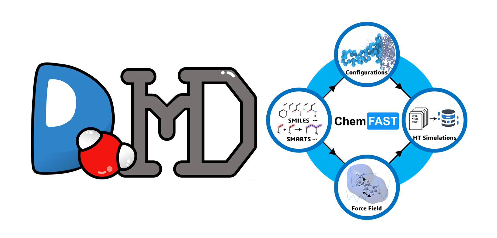

# ChemFAST

<p align="center">
  
</p>

**ChemFAST builds atomistic polymer models from chemical definitions.** Users specify molecular reactants, reaction rules, and construction constraints through Reaction-DSL. ChemFAST connects these definitions to coarse-grained (CG) model preparation, reaction-history-based all-atom (AA) reconstruction, and OPLS-AA force-field assignment.

```text
Chemical definitions → CG construction → AA reconstruction → Force-field assignment
```

External molecular dynamics engines perform CG polymerization and subsequent AA relaxation. Users can follow the complete workflow or start from an existing CG configuration and compatible reaction records.

[Documentation](https://chemfast.readthedocs.io/en/latest/) ·
[Quick start](docs/quick-start.md) ·
[Tutorials](docs/tutorials/index.md) ·
[CLI Reference](docs/cli.md) ·
[Core API](docs/api/index.md)

ChemFAST is part of the broader DoMD project. The [DoMD online tools](https://www.domd.today/tools/) provide browser-based workflows; see [Online tools](docs/online-tools.md) for their capabilities and inputs.

## Installation

ChemFAST requires **Python ≥3.12** and **RDKit ≥2025.09.5**. We recommend Conda or Miniconda.

### Option A: Complete release package (recommended)

Download and extract the complete package from the [ChemFAST v1.0.0 release](https://github.com/DoMD-toolkit/ChemFAST/releases/tag/ChemFAST-v1.0.0). It includes the full OPLS database.

From the extracted project root containing `environment.yml` and `pyproject.toml`, run:

```bash
conda env create -f environment.yml
conda activate chemfast
python -c "import chemfast; print(chemfast.__version__); print(chemfast.__file__)"
chemfast --help
```

The environment file installs ChemFAST from the local project. The Python command reports the installed version and import location.

### Option B: Source repository

```bash
git clone https://github.com/DoMD-toolkit/ChemFAST.git ChemFAST
cd ChemFAST

conda create -n chemfast -c conda-forge python=3.12 "rdkit>=2025.09.5" openbabel numba networkx pandas scipy jupyter scikit-learn matplotlib mdanalysis pip
conda activate chemfast

python -m pip install torch --index-url https://download.pytorch.org/whl/cpu
python -m pip install torch-geometric pytest
python -m pip install -e .
```

Download the complete [`opls.db`](https://github.com/DoMD-toolkit/ChemFAST/releases/download/ChemFAST-v1.0.0/opls.db) and place it at the following path relative to the project root:

```text
src/chemfast/ff/opls/opls_db/resources/opls.db
```

The small database supplied in the source tree does not replace the complete release database.

Verify the installation:

```bash
python -c "import chemfast; print(chemfast.__version__); print(chemfast.__file__)"
chemfast --help
```

See [Installation](docs/installation.md) for further details.

## Simulation engines

Install the required MD engines separately:

| Engine | Role |
| --- | --- |
| [PyGAMD](https://pygamd-v1.readthedocs.io/en/latest/installation.html) | CG polymerization and pre-equilibration in the supplied reactive tutorials |
| [GROMACS](https://manual.gromacs.org/current/install-guide/index.html) | AA energy minimization and equilibration |
| [HOOMD-blue](https://hoomd-blue.readthedocs.io/en/stable/installation.html) | Alternative CG execution protocols requiring compatible inputs and reaction records |

The generated tutorial runners target PyGAMD. Follow the selected engine's installation requirements for Python, operating system, CUDA, and GPU compatibility.

## Quick start: linear polyimide

Download and extract the [tutorial archive](docs/_static/chemfast-tutorials.zip). Start from the extracted directory containing `01_linear_pi/config.json`.

### Fast route: use the supplied CG result

The archive includes a matching CG configuration and reaction history:

```text
01_linear_pi/cg/reaction_final.xml
01_linear_pi/cg/reaction_path.txt
```

With ChemFAST and the complete OPLS database installed, run:

```bash
chemfast reconstruct_aa --name 01_linear_pi
```

This route performs AA reconstruction and force-field assignment without running PyGAMD.

### Complete route: generate a new CG system

**1. Prepare CG inputs in a separate workspace:**

```bash
chemfast prepare_cg --json 01_linear_pi/config.json --name 01_linear_pi_new
```

This creates:

```text
01_linear_pi_new/
├── config.json
└── cg/
    ├── initial.xml
    ├── cg_parameters.json
    └── run_pygamd_polymerization.py
```

CG preparation generates simulation inputs; it does not run MD. The separate workspace preserves the supplied CG result.

**2. Run CG polymerization and pre-equilibration:**

Use a Python environment with a compatible PyGAMD installation:

```bash
cd 01_linear_pi_new/cg
python run_pygamd_polymerization.py initial.xml cg_parameters.json --gpu=0
cd ../..
```

The generated runner must be executed from its `cg/` directory. Confirm that it produces both `reaction_final.xml` and `reaction_path.txt` from the same run.

**3. Reconstruct the AA model and assign force-field parameters:**

Using the ChemFAST environment, run:

```bash
chemfast reconstruct_aa --name 01_linear_pi_new
```

Both routes write the following outputs under their respective workspace:

```text
aa/
├── atomistic.sdf
├── system.gro
├── system.top
└── *.itp
```

These files describe the reconstructed initial AA system. Follow [AA minimization and equilibration](docs/tutorials/aa-relaxation.md) for subsequent GROMACS relaxation.

ChemFAST CLI commands accept relative or absolute paths. Only the generated PyGAMD runner requires the corresponding `cg/` working directory. See the [CLI Reference](docs/cli.md) for path conventions and options.

## Tutorials

The [tutorial guide](docs/tutorials/index.md) introduces six systems through chemical inputs, CG construction, AA reconstruction, and available relaxation results:

| Tutorial | Main concept |
| --- | --- |
| [Linear polyimide](docs/tutorials/first-system.md) | General step-growth reactions |
| [Radical PMMA](docs/tutorials/radical-pmma.md) | Active-state transfer during propagation |
| [Cross-linked polyimide](docs/tutorials/network.md) | Multifunctional reactants and network construction |
| [POSS–PMMA](docs/tutorials/poss.md) | Structured PDB fillers and reactive-site mappings |
| [Multicomponent SPE](docs/tutorials/spe.md) | Crosslinkers, molecular spectators, and ions |
| [PS-b-PEO](docs/tutorials/block-ps-peo.md) | Prescribed block connectivity and ReactionPath |

PS-b-PEO uses its supplied generator and pre-equilibration runner. POSS–PMMA includes energy-minimization results only. Tutorial relaxation protocols do not establish production equilibration.

For structured components, `fillers[*].file` accepts **PDB files**. See [Reaction-DSL](docs/reaction-dsl.md) for reactive-group definitions and mappings.

## Data

The [polyimide dataset and BOSS-generated force-field parameter data](https://drive.google.com/file/d/1gjorYia5Tp012TrJT6zt5BZV3NwX0Tig/view?usp=sharing) from this work are available for download.

## Testing

Run tests from the ChemFAST project root in the installed environment:

```bash
# Unit tests
python -m pytest tests/unit -q

# Integration tests
python -m pytest tests/integration -q

# Reproducibility checks against approved reference outputs
python -m pytest tests/reproducibility -q -s

# Complete suite
python -m pytest tests -q
```

Unit and integration tests check DSL handling, reaction behavior, mappings, and reconstruction interfaces. Reproducibility tests compare newly generated coordinates, topology, and force-field parameters with approved golden files using defined numerical tolerances.

Database-dependent tests require the complete OPLS database; ML tests require the packaged model checkpoints. The suite checks CG preparation outputs but does not execute PyGAMD polymerization trajectories or GROMACS production simulations.

See [Software testing](docs/testing.md) for test coverage, resource requirements, comparison tolerances, and report generation.

## Documentation

- [Installation](docs/installation.md)
- [Workflow](docs/workflow.md)
- [Input Reference](docs/inputs.md) and [Reaction-DSL](docs/reaction-dsl.md)
- [Usage Guide](docs/usage.md) and [CLI Reference](docs/cli.md)
- [Core API](docs/api/index.md)
- [Tutorials](docs/tutorials/index.md)
- [Software testing](docs/testing.md)

Read the [online documentation](https://chemfast.readthedocs.io/en/latest/) or build it locally. With the documentation dependencies installed, run from the project root:

```bash
python -m sphinx -a -b html docs docs/build/html
```

Open `docs/build/html/index.html` in a browser. Documentation dependencies and build instructions are listed in [Software testing](docs/testing.md#building-the-documentation).

## License

See [LICENSE](LICENSE) for permitted uses and restrictions, including non-commercial use and the prohibition on AI/ML training use.
