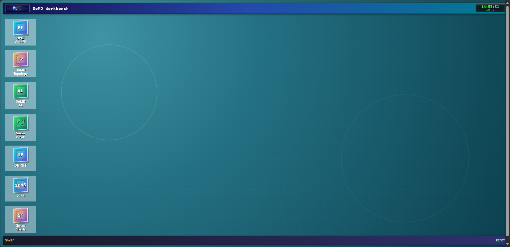
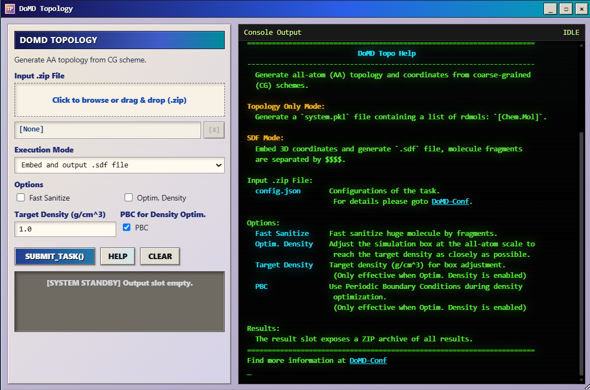
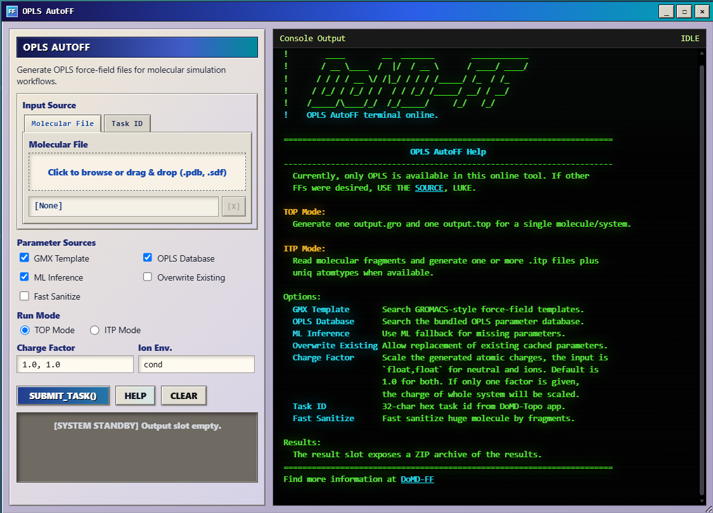
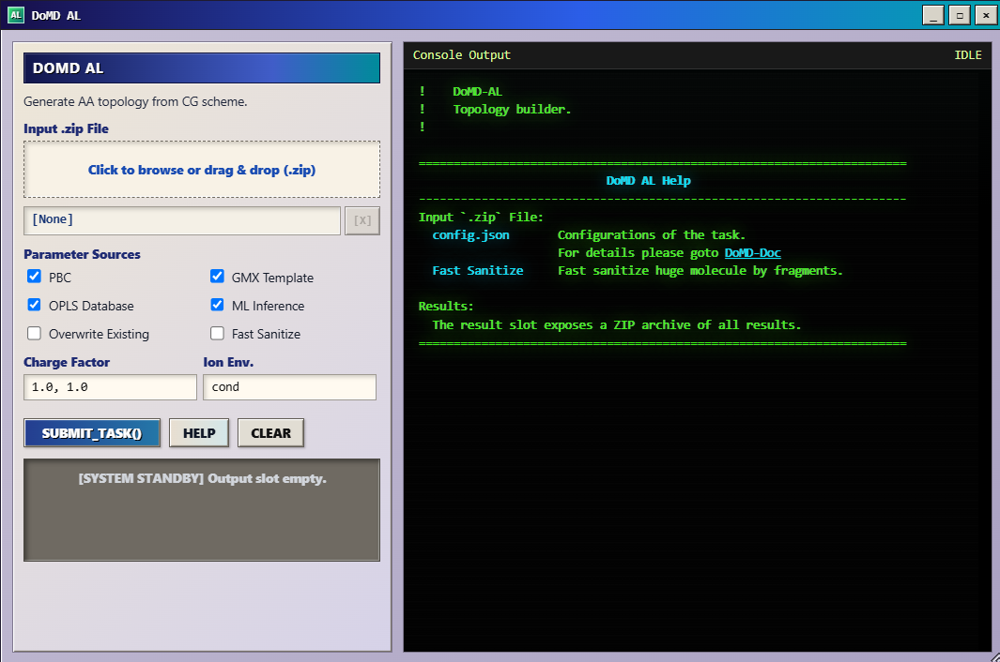

# Online Tools

[Open DoMD Online Tools](https://domd.today/tools) to access browser-based molecular modeling workflows without installing ChemFAST or learning command-line commands first.

The DoMD Workbench provides three scientific tools: **DoMD Topology**, **OPLS AutoFF**, and **DoMD AL**. DoMD Topology and OPLS AutoFF can be used independently or connected through Task IDs. DoMD AL integrates both modules with an additional field-theory-based polymerization stage.

## How the tools work together

| Tool | Main function | When to use it |
|---|---|---|
| **DoMD Topology** | Reconstructs atomistic topology and coordinates from a coarse-grained (CG) scheme. | You already have a CG structure and the corresponding reaction information. |
| **OPLS AutoFF** | Assigns atomistic force-field parameters and generates force-field files. | You have an atomistic structure or want to parameterize a structure generated by DoMD Topology. |
| **DoMD AL** | Integrates field-theory-based CG polymerization, atomistic reconstruction, and force-field assignment. | You want to start from a polymerization configuration and run the connected workflow. |

The modules can be connected in two ways:

**Starting from an existing CG structure:**

DoMD Topology → OPLS AutoFF

**Starting from a Reaction-DSL configuration:**

DoMD AL: Field-theory-based CG polymerization → AA topology and coordinate reconstruction → FF assignment

DoMD AL includes the reconstruction and parameterization stages rather than requiring users to run the other two modules separately.

### Connecting modules with Task IDs

Each online job is assigned a **Task ID**, which identifies its results and allows compatible information to be reused across modules.

For example, after completing a DoMD Topology task, users can enter its Task ID in OPLS AutoFF to perform force-field assignment using the files generated by that task. This avoids preparing and uploading the same intermediate files again.

Keep the Task ID for each completed job. Task IDs connect computational stages, but users should still inspect the resulting structures, topologies, and force-field parameters before further simulation.

## DoMD Topology

**DoMD Topology** reconstructs atomistic topology and coordinates from a CG structure and its corresponding reaction information.

The reconstructed structure can be used for subsequent atomistic force-field assignment. OPLS AutoFF can access compatible files produced by a DoMD Topology task through its Task ID.

### Density optimization

DoMD Topology provides an optional density-optimization stage to improve the initial packing of the reconstructed atomistic system.

To limit computational cost, the online optimization uses a simplified geometric model:

- Each reactant and filler is treated as a rigid body during optimization.
- Every atom is assigned a simplified Lennard-Jones (LJ) interaction with `sigma = 2 × elemental van der Waals radius` and `epsilon = 1`.
- Cross-bead bond lengths are initialized using a covalent-radius-based rule.
- **Density optimization is limited to 500 steps.**

The simplified LJ parameters and bond-length estimates are used for geometric optimization. **They are not the final chemically parameterized atomistic force field.**

The rigid-body treatment and 500-step limit control the computational cost of the online service, but they also limit the extent of structural relaxation. Density optimization should not be interpreted as complete atomistic energy minimization or thermodynamic equilibration.

For further atomistic simulation, use an appropriate force field and perform additional minimization and equilibration as needed.

## OPLS AutoFF

**OPLS AutoFF** automates atomistic force-field parameterization and the preparation of force-field files for molecular simulation.

Users can provide a molecular structure or select a compatible existing task. In particular, OPLS AutoFF can inherit files generated by DoMD Topology and perform force-field assignment as the next stage of the workflow.

The interface provides options for OPLS database parameters, ML inference, GROMACS templates, and output formats.

### Computational limitations

**GMX Template is used only for molecules containing fewer than 5000 atoms.** For molecules containing 5000 atoms or more, this parameterization option is not used.

This threshold applies specifically to GMX Template. It does not mean that every other OPLS AutoFF operation is unavailable for larger molecules.

Online jobs also share finite server resources. Large structures and computationally demanding parameterization tasks may require more time or may be better suited to local execution.

The generated parameters should be inspected before production simulation, particularly when the selected parameter sources include ML inference.

## DoMD AL

**DoMD AL** is an integrated polymerization and molecular construction workflow. It combines a field-theory-based CG polymerization stage with the atomistic reconstruction and force-field assignment stages provided by DoMD Topology and OPLS AutoFF.

Unlike an MD-based reaction workflow, its polymerization stage **does not require molecular dynamics to generate reaction encounters**. Instead, it uses field theory to estimate collision probabilities, identifies candidate reaction events, and selects candidates for reaction according to the configured rules.

The integrated workflow proceeds through the following stages:

1. Construct the initial CG system.
2. Estimate collision probabilities using field theory.
3. Identify and select candidate reaction events.
4. Execute the selected reactions to update the CG structure and reaction path.
5. Reconstruct the atomistic topology and coordinates.
6. Perform atomistic force-field assignment.

### Experimental status

**DoMD AL is experimental and has not yet undergone comprehensive testing.**

Its field-theory-based collision estimates procedure should not be treated as independently validated predictions of polymerization kinetics. Results should be checked for consistency with the intended chemistry and system topology.

The subsequent atomistic reconstruction and force-field assignment stages do not eliminate the uncertainties associated with the preceding polymerization stage.

DoMD AL provides an integrated route from a polymerization configuration to a reconstructed, parameterized molecular system. Further validation may be required before using its outputs for quantitative scientific conclusions.

## Online and local workflows

The online tools make molecular system construction accessible without requiring users to install or operate the complete local software stack.

**The principal limitation of the online service is computational capacity.** Server resources and execution-time constraints limit the size and complexity of jobs that can be handled conveniently in the browser. Restrictions also depend on the selected module: DoMD Topology limits density optimization to 500 steps, while OPLS AutoFF applies the 5000-atom condition to GMX Template.

The online tools prepare molecular structures, topology information, reaction paths, and force-field files. They do not replace subsequent production molecular dynamics with GROMACS or PyGAMD.

For larger systems, customized methods, extended structural relaxation, or reproducible local simulations, continue to [Installation](installation.md) and [Quick Start](quick-start.md).

The DoMD Workbench also includes optional mini-games that users can explore while waiting for computational tasks to finish.