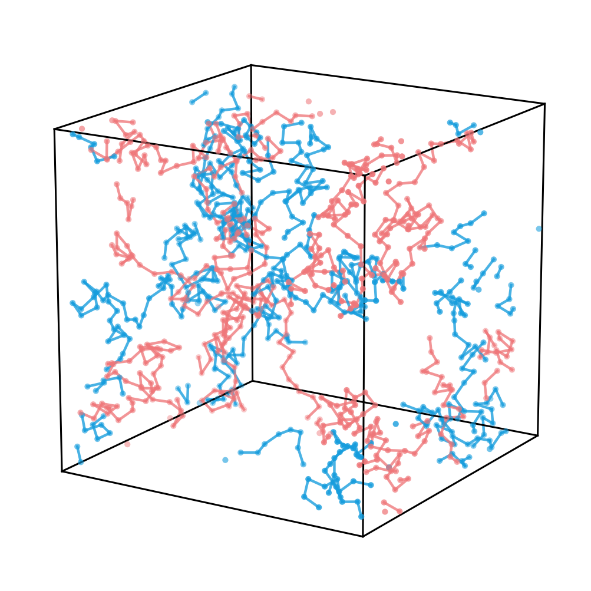
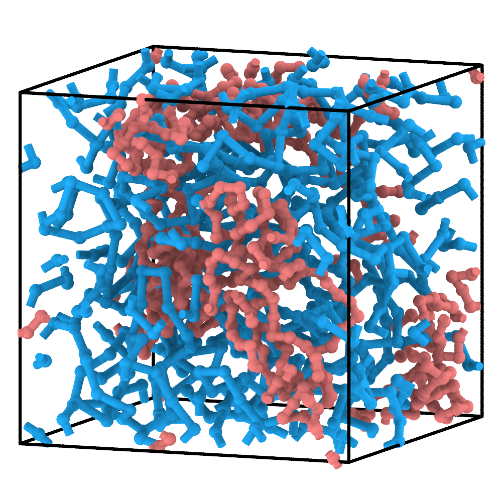
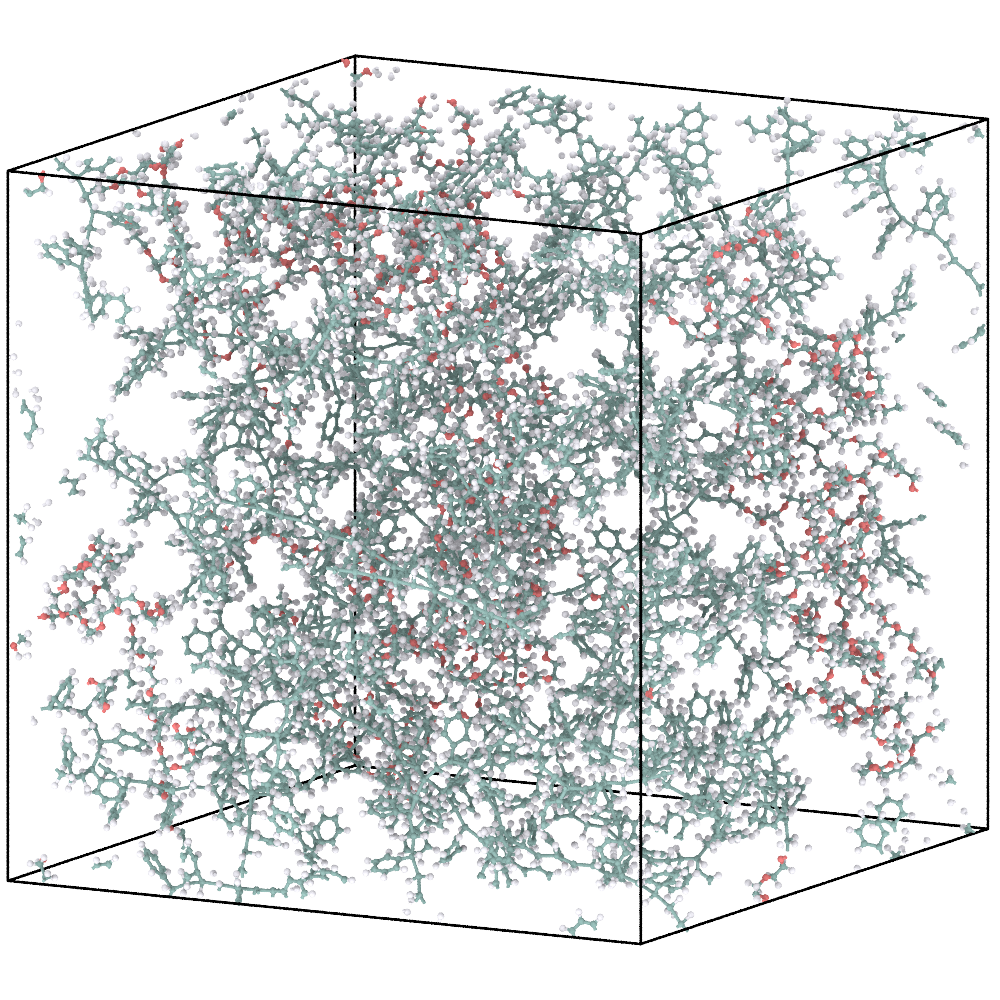
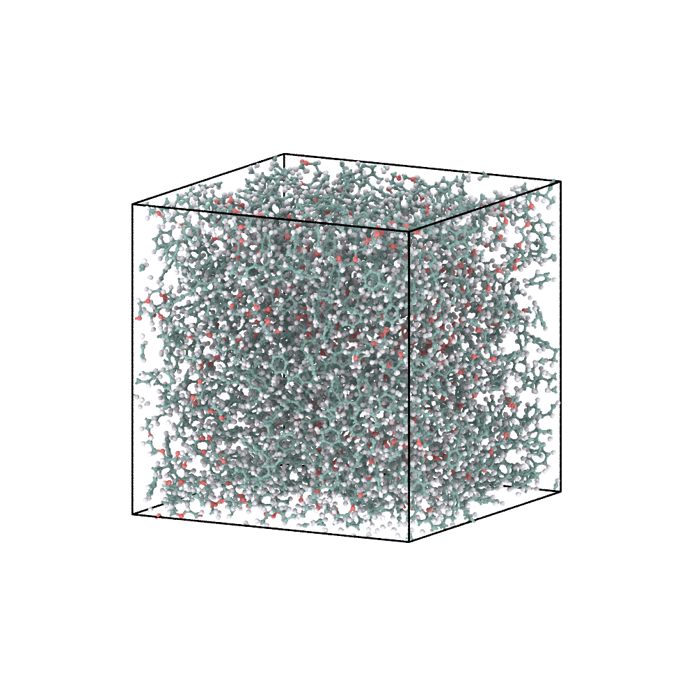

# 6. PS-b-PEO: prescribe the block architecture

Unlike the first five tutorials, this example uses a predefined CG topology
rather than generating chain connectivity through reactive CG simulation.
The block sequence is specified before simulation. ChemFAST constructs the
CG topology and ReactionPath directly, then uses CG dynamics to relax the
prescribed architecture.

## 1. Define the two blocks

Styrene-derived `S` and PEO-derived `O` are represented by blue and coral CG
beads, respectively.

```{figure} ../_static/tutorials/03_ps_b_peo/reactants.svg
:alt: Styrene- and PEO-derived molecular structures mapped to blue S and coral O CG beads.
:width: 92%

Chemical definitions used for the PS and PEO blocks.
```

```{literalinclude} example-files/03_ps_b_peo/config.json
:language: json
```

Although the example `config.json` sets `N: 20` for both S and O, these values
do not determine the number or length of the predefined chains. The
`generate_predefined_cg.py` script constructs ten chains containing 50 S and
50 O beads each. The DSL provides the molecular definitions and reaction
templates used for subsequent AA reconstruction.

The three reaction templates, `S-S`, `S-O`, and `O-O`, define the atomistic
connectivity transformations for the corresponding CG connections. They do
not determine the block architecture in this example.

Each predefined chain has the sequence:

```text
S × 50 — O × 50
```

Its ReactionPath therefore contains 49 `S-S`, one `S-O`, and 49 `O-O`
records.

## 2. Build and relax the prescribed CG chains

From the extracted tutorial root, run:

```bash
python 03_ps_b_peo/generate_predefined_cg.py
cd 03_ps_b_peo/cg
python ../run_pygamd_pre_equilibration.py --gpu=0
cd ../..
```

The generator writes `cg/initial.xml`, `cg/cg_parameters.json`, and the
predefined `cg/reaction_path.txt`. PyGAMD then relaxes the CG configuration
and writes `cg/reaction_final.xml`.

| Prescribed CG chains before relaxation | Pre-equilibrated CG configuration |
|---|---|
|  |  |

The initial panel was rendered from the generated `initial.xml`. During
pre-equilibration, bead coordinates change while the prescribed block
sequence, connectivity, and ReactionPath remain unchanged.

## 3. Reconstruct the atomistic model

For standard AA reconstruction, run from the extracted tutorial root:

```bash
python reconstruct_aa.py 03_ps_b_peo
```

The AA coordinates and topology are written to `03_ps_b_peo/aa/`.

Alternatively, run the advanced workflow with rigid-body density optimization:

```bash
python reconstruct_aa_adv.py 03_ps_b_peo
```

This workflow reconstructs the AA model and calls PyGAMD to rearrange
residues as rigid bodies while adjusting the simulation box toward the
target density. The resulting AA coordinates and topology are written to
`03_ps_b_peo/aa_density_optim/`.

Both workflows use the prescribed `S-S`, `S-O`, and `O-O` ReactionPath
records to reconstruct atomistic connectivity, including the junction
between the PS and PEO blocks. See [AA relaxation](aa-relaxation.md) for
the density-optimization procedure and subsequent GROMACS steps.

| Final CG configuration | Energy-minimized AA reconstruction |
|---|---|
|  |  |

The AA panel shows an energy-minimized configuration, rather than the
initial AA coordinates produced directly by ChemFAST.

## 4. Minimize and equilibrate the AA model

The reconstructed AA configuration requires atomistic energy minimization
before further MD. Follow [AA relaxation](aa-relaxation.md) using the output
directory of the selected reconstruction workflow.

For tutorials with an EQ stage, the supplied example MDP settings provide
a short AA continuation after EM.

| Energy-minimized AA model | AA model after the supplied short equilibration |
|---|---|
|  |  |

The short AA continuation relaxes the reconstructed structure. It does not
define a production equilibration protocol for block-copolymer properties.

## What to inspect

- Each chain contains 100 CG sites in the expected `S...S-O...O` order.
- CG relaxation preserves the prescribed connectivity and ReactionPath.
- ReactionPath node identifiers match those in `reaction_final.xml`.
- The reconstructed AA topology retains the intended PS–PEO junction.
- The AA configuration has been minimized before subsequent MD.

Continue to [Software testing](../testing.md).