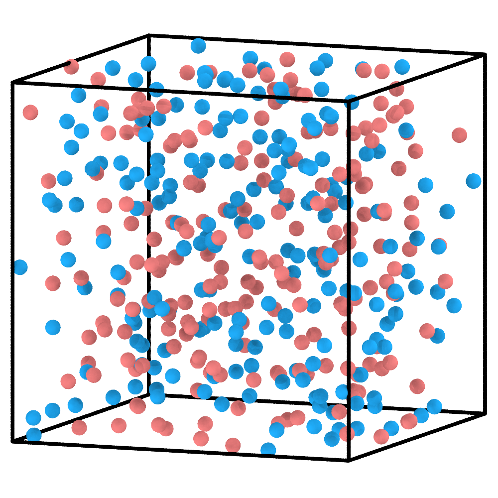
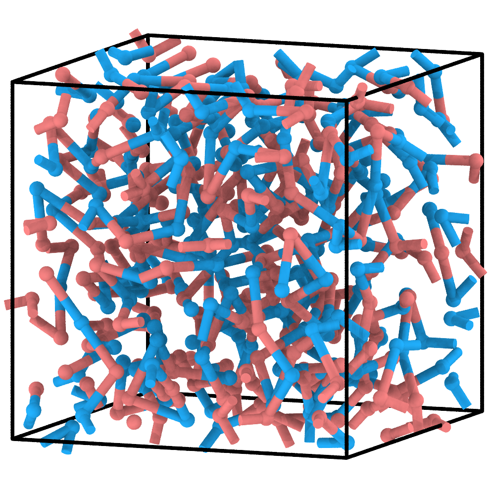
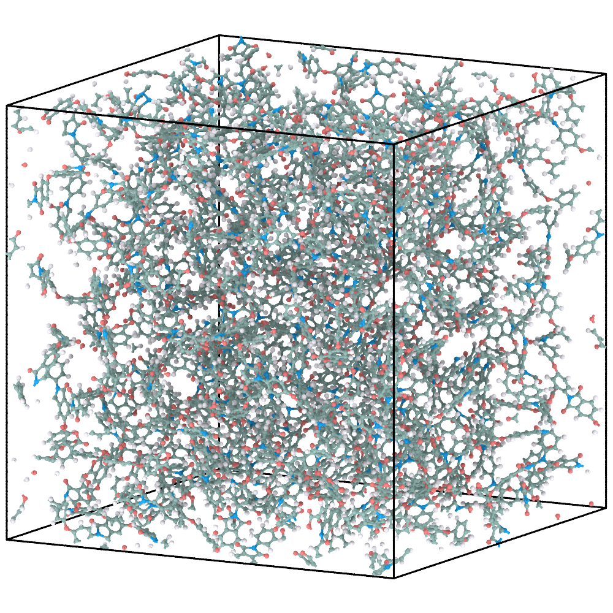
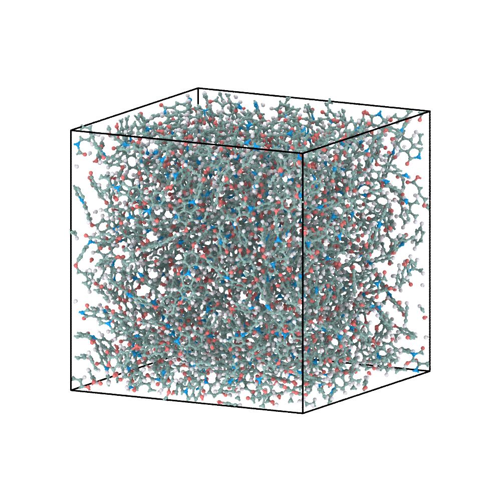

# 1. Linear polyimide: write the first Reaction-DSL

This example follows the complete ChemFAST path: define the chemistry, construct
and relax a CG system, reconstruct the atomistic model, and briefly equilibrate
the AA coordinates.

## 1. Define the reactants

The system contains dianhydride `A` and diamine `B1`. Each molecular reactant is
represented by one CG bead; the bead colours below are used throughout the CG
snapshots.

```{figure} ../_static/tutorials/01_linear_pi/reactants.svg
:alt: Molecular structures of the dianhydride A and diamine B1 mapped to coral and blue CG beads.
:width: 92%

Molecular definitions and their one-bead CG representations.
```

The complete input is:

```{literalinclude} example-files/01_linear_pi/config.json
:language: json
```

Both reactants have `max_valence: 2`, allowing two reaction-generated CG
connections per bead. The two ordered `general` rules, `A-B1` and `B1-A`,
describe the same imidization chemistry for the two participant orders used by
the generated protocol. Their mapped SMARTS provides the atomistic edit that is
replayed after CG construction; `prod_idx: [0]` retains the imide-containing
product.

## 2. Choose a CG input route

**Option A — reconstruct the supplied result (no PyGAMD required).** The
tutorial archive includes `01_linear_pi/cg/reaction_final.xml` and
`01_linear_pi/cg/reaction_path.txt` as a matched pair. Run from the extracted
tutorial directory (or supply an absolute workspace path):

```bash
chemfast reconstruct_aa --name 01_linear_pi
```

Here `--name 01_linear_pi` selects the supplied example directory. Its
`config.json` and two CG result files are read from their fixed locations;
the AA outputs are written to `01_linear_pi/aa/`.

Continue at Step 4 after this command. This skips CG simulation, **not**
force-field assignment: the full OPLS database must still be installed
for the AA export. The supplied coordinates
are an input for reconstruction, not a claim of final AA equilibration.

**Option B — create your own CG model with PyGAMD.** The supplied
`01_linear_pi/cg/` already contains the matched fast-route result, whereas
`prepare_cg` requires an empty output `cg/` directory. Keep that result intact
and use a **new workspace** named `01_linear_pi_new`:

```bash
chemfast prepare_cg --json 01_linear_pi/config.json --name 01_linear_pi_new
```

`--name` is the new workspace. The CLI places a copy of the configuration at
`01_linear_pi_new/config.json` and writes `initial.xml`, `cg_parameters.json`,
and `run_pygamd_polymerization.py` to `01_linear_pi_new/cg/`.

Switch to `01_linear_pi_new/cg/` and run the generated PyGAMD script:

```bash
python run_pygamd_polymerization.py initial.xml cg_parameters.json --gpu=0
```

The CG run writes `reaction_final.xml` and `reaction_path.txt` in the same
`cg/` directory. Return to the extracted tutorial directory before using a
relative `--name` in Step 3, or supply the absolute workspace path.

| Initial CG mixture | Polymerized and pre-equilibrated CG configuration |
|---|---|
|  |  |

Option B generates its own CG results in `01_linear_pi_new/cg/` without
replacing the supplied fast-route XML and ReactionPath.
The initial frame contains separate A and B1 beads. During the run, spatially
accepted reactions create CG connections and are written in order to
`reaction_path.txt`. The final configuration and ReactionPath must come from
the same run.

## 3. Reconstruct the atomistic model

If you completed Option A in Step 2, AA reconstruction is already finished.
For Option B, run from the extracted tutorial directory:

```bash
chemfast reconstruct_aa --name 01_linear_pi_new
```

`--name` must identify the **same workspace** you just prepared. The CLI reads
`01_linear_pi_new/config.json` and the two files in
`01_linear_pi_new/cg/`, then writes AA results into `01_linear_pi_new/aa/`.
The corresponding outputs for Option A are in `01_linear_pi/aa/`.

| Final CG configuration | Energy-minimized AA reconstruction |
|---|---|
|  |  |

ChemFAST replays the recorded reactions to build atomistic connectivity, then
uses the final CG coordinates to place the molecular fragments. Force-field
assignment and export produce `atomistic.sdf`, `system.gro`, `system.top`,
`atomtypes.itp`, and the molecule ITP files.

## 4. Briefly equilibrate the AA model

See [AA relaxation](aa-relaxation.md) for the external GROMACS steps used to
produce EM/EQ coordinates from the reconstructed `system.gro`.

| Energy-minimized AA model | AA model after the supplied short equilibration |
|---|---|
|  |  |

The short AA run removes residual local strain and demonstrates that the
exported model can continue in an atomistic MD engine. It is an initial
equilibration, not a production protocol.

## What to inspect

- no A or B1 bead exceeds two reaction-generated connections;
- the ReactionPath contains only `A-B1` and `B1-A` events;
- the CG configuration and ReactionPath refer to the same node numbering;
- the AA topology, coordinates, and included force-field files form one
  consistent export set.

Next: [Radical PMMA](radical-pmma.md).
