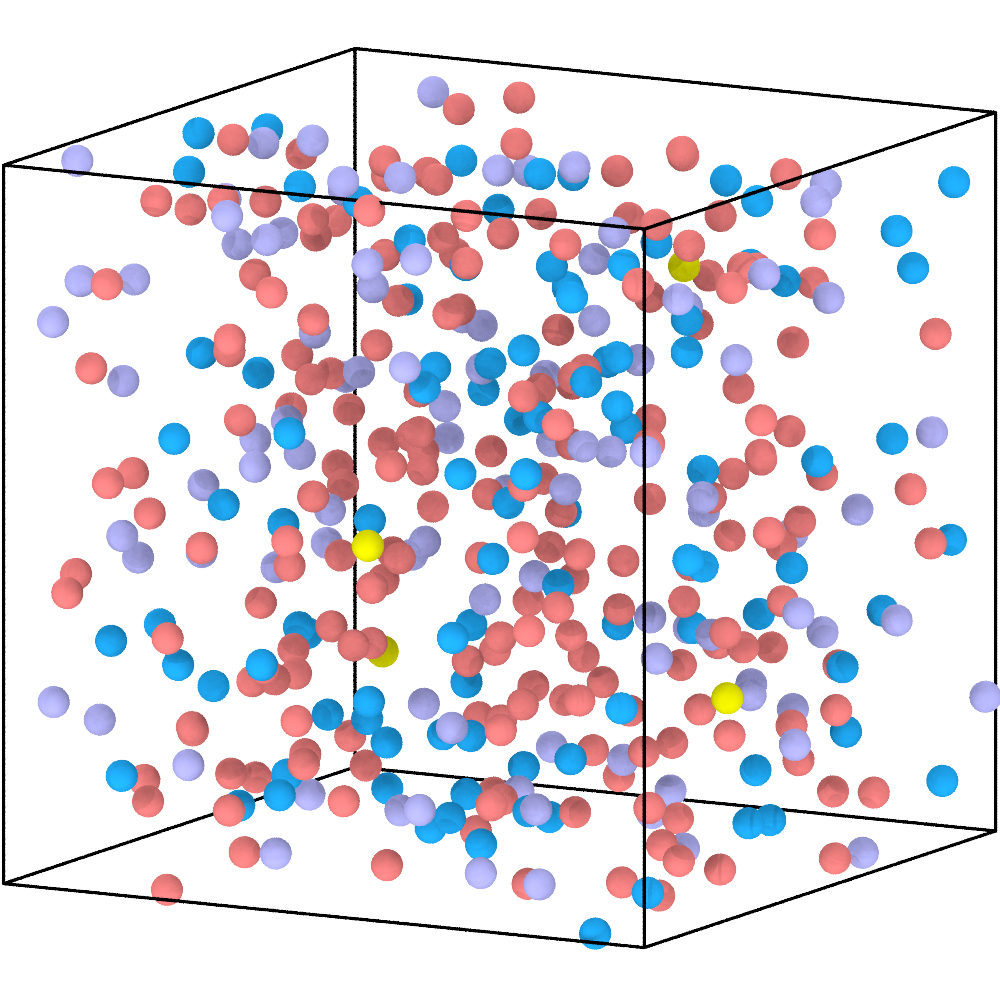
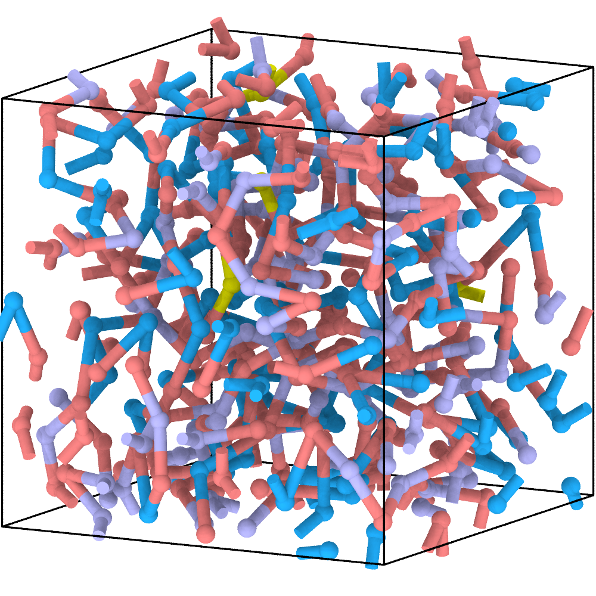
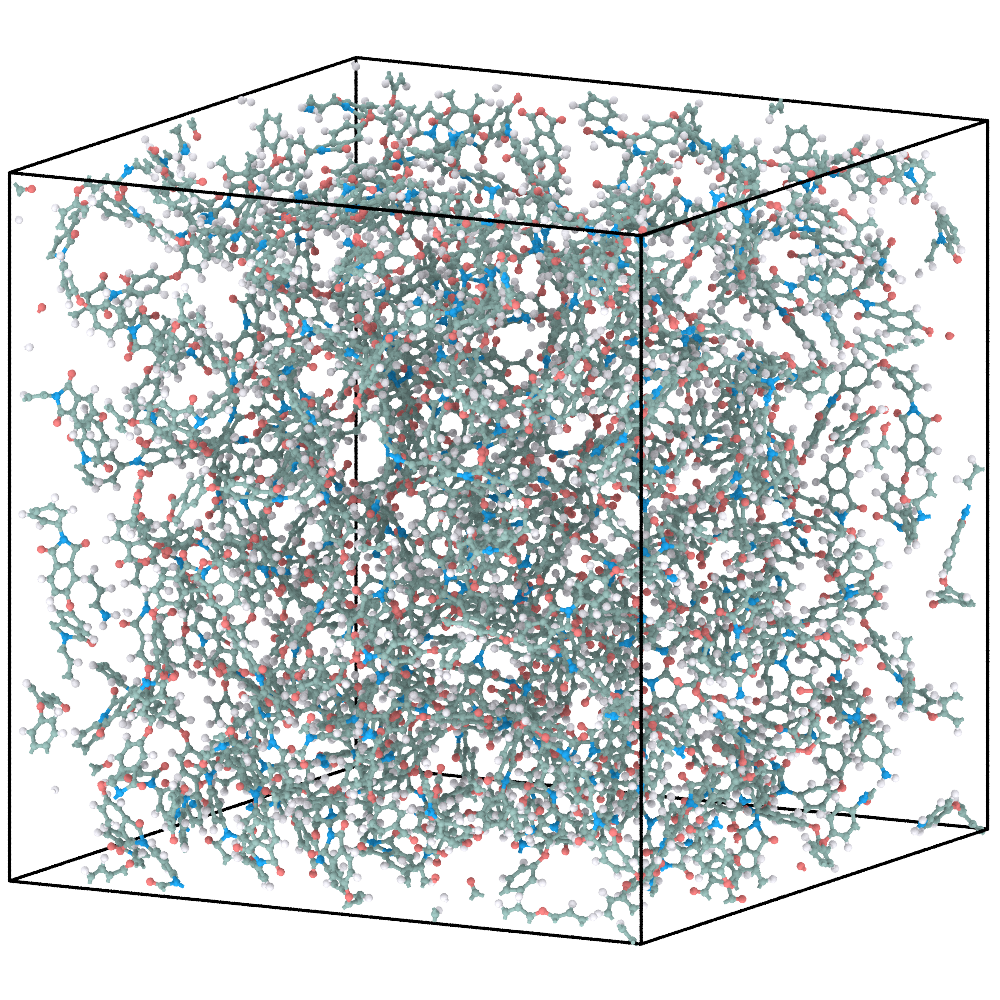
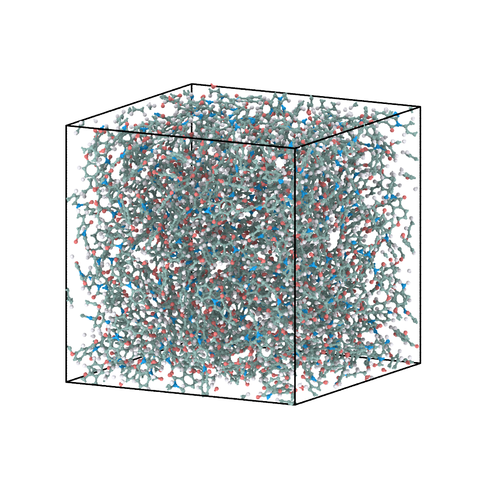

# 3. Cross-linked polyimide: introduce multifunctional branching

This example extends the linear polyimide chemistry with a trifunctional amine.
The reconstruction procedure is unchanged; branching emerges from the permitted
CG connections.

## 1. Define the network-forming reactants

The four molecular reactants and their CG colours are shown below.

```{figure} ../_static/tutorials/04_network_pi/reactants.svg
:alt: Molecular structures of A, B1, B2, and C mapped to coral, blue, lavender, and yellow CG beads.
:width: 100%

Network-forming reactants and their one-bead CG representations.
```

```{literalinclude} example-files/04_network_pi/config.json
:language: json
```

| Type | Count | `max_valence` | Role |
|---|---:|---:|---|
| `A` | 200 | 2 | bifunctional dianhydride |
| `B1` | 100 | 2 | bifunctional diamine |
| `B2` | 100 | 2 | second bifunctional diamine |
| `C` | 4 | 3 | trifunctional branch point |

The six ordered rules cover `A-B1`, `A-B2`, and `A-C` in both participant
orders. They share the same local imidization SMARTS. Composition and
`max_valence` determine the possible network topology; the SMARTS determines
the atomistic transformation.

## 2. Construct and relax the CG network

```bash
python prepare_cg.py 04_network_pi
cd 04_network_pi/cg
python run_pygamd_polymerization.py initial.xml cg_parameters.json --gpu=0
cd ../..
```

| Initial CG mixture | Polymerized and pre-equilibrated CG network |
|---|---|
|  |  |

The yellow C beads can accept three reaction-generated connections, creating
branch points among the bifunctional components. Trifunctionality permits a
network but does not guarantee that every finite trajectory percolates.

## 3. Reconstruct the atomistic network

```bash
python reconstruct_aa.py 04_network_pi
```

| Final CG network | Energy-minimized AA reconstruction |
|---|---|
|  |  |

ReactionPath replay assigns the correct diamine or trifunctional amine to every
accepted CG event. The final CG geometry guides the placement of the resulting
atomistic network.

## 4. Briefly equilibrate the AA model

See [AA relaxation](aa-relaxation.md) for the external GROMACS steps used to
produce EM/EQ coordinates from the reconstructed `system.gro`.

| Energy-minimized AA model | AA model after the supplied short equilibration |
|---|---|
|  |  |

This short run provides an initial coordinate relaxation only. Network
properties require an independently validated production protocol.

## What to inspect

- C beads never exceed three reaction-generated connections;
- A, B1, and B2 beads never exceed two;
- ReactionPath rules agree with the participating bead types;
- the atomistic network and force-field export contain the expected branch
  points and all required bonded terms.

Next: [POSS-PMMA](poss.md).
