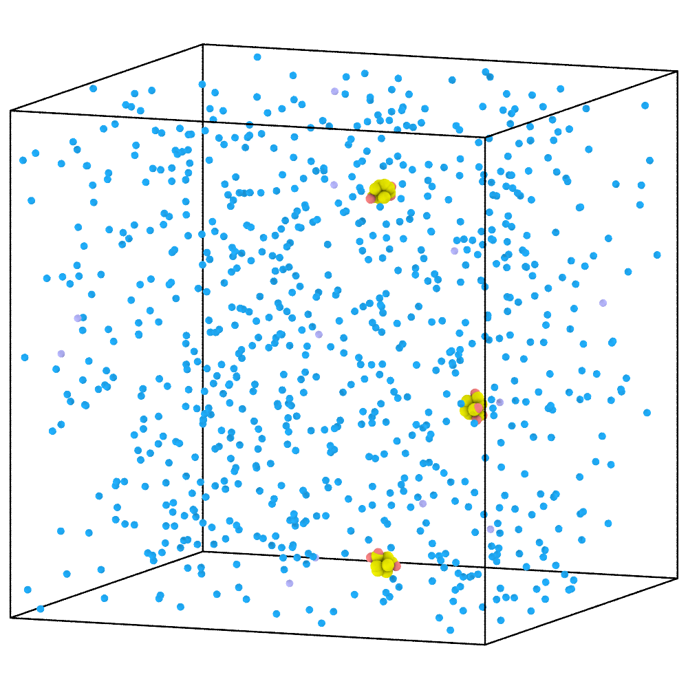
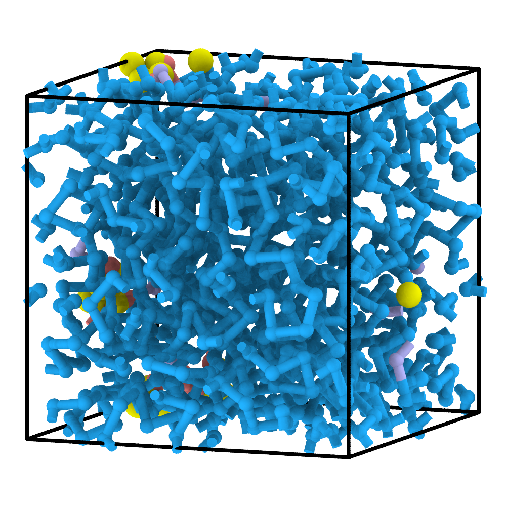
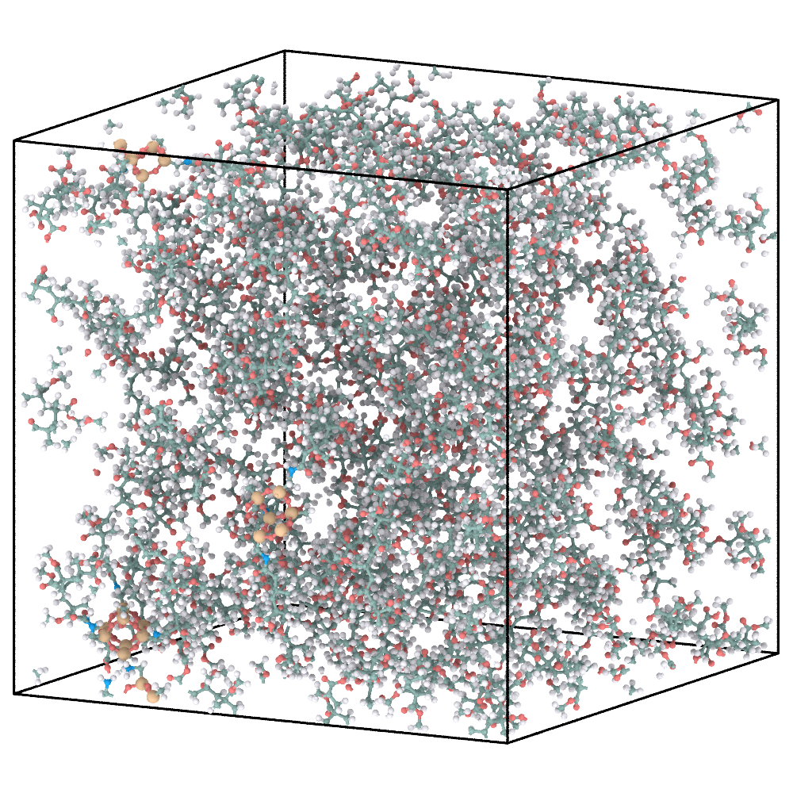

# 4. POSS-PMMA: map reactions onto a structured component

This example combines free molecular reactants with a functionalized POSS
structure supplied as an atomistic PDB file.

## 1. Define the molecular and structured reactants

`P` and `A` are free molecular reactants. POSS is shown as the complete
structured component and is represented at CG resolution by one rigid point
cloud. Its local `CN` SMARTS is used only to locate reactive arms and is
therefore not drawn as a separate molecule.

```{figure} ../_static/tutorials/05_poss_pmma/reactants.svg
:alt: Molecular structures of P and A together with the complete functionalized POSS component and their CG representations.
:width: 100%

Free reactants and the complete structured POSS component.
```

```{literalinclude} example-files/05_poss_pmma/config.json
:language: json
```

Each POSS copy contains four mapped `CN` arms. The PDB provides the full
reference geometry, while each `atom_idx` list identifies one reactive group.
Three POSS copies therefore supply 12 arms, matching `activate: 12`. The
`CN-A`, `A-P`, and `P-P` radical rules transfer activity from the surface
into the growing PMMA chain.

## 2. Construct and relax the CG hybrid

Run this command from the extracted tutorial directory (or replace the paths
with absolute paths). `--name` identifies the workspace for this example;
`05_poss_pmma/cg/` receives the generated `initial.xml`,
`cg_parameters.json`, and `run_pygamd_polymerization.py`.

```bash
chemfast prepare_cg --json 05_poss_pmma/config.json --name 05_poss_pmma
```

Next, switch to `05_poss_pmma/cg/` and run the **generated** PyGAMD script
with an interpreter that supports PyGAMD:

```bash
python run_pygamd_polymerization.py initial.xml cg_parameters.json --gpu=0
```

Once PyGAMD finishes, `05_poss_pmma/cg/` should contain the matching
`reaction_final.xml` and `reaction_path.txt`. Return to the extracted tutorial
directory before using the relative `--name` in the following command; alternatively,
provide the absolute workspace path to run the CLI from anywhere.

| Initial CG mixture | Polymerized and pre-equilibrated CG hybrid |
|---|---|
|  |  |

The rigid point cloud preserves the geometry of each POSS component while its
mapped arms enter the same reaction-selection pools as compatible free
reactants.

## 3. Reconstruct the atomistic hybrid

```bash
chemfast reconstruct_aa --name 05_poss_pmma
```

The CLI reads `05_poss_pmma/config.json` and the two fixed CG outputs from
`05_poss_pmma/cg/`, then writes the reconstructed SDF and GROMACS files to
`05_poss_pmma/aa/`. No CG result filenames need to be passed again.

| Final CG hybrid | Energy-minimized AA reconstruction |
|---|---|
|  |  |

Rigid-body alignment restores each full PDB structure at its CG position.
ReactionPath replay then applies the recorded surface reactions to the mapped
PDB atoms and the attached molecular fragments.

## 4. AA output: energy minimization only

| Energy-minimized AA model | Equilibrated AA model (not supplied) |
|---|---|
|  |  |

See [AA relaxation](aa-relaxation.md) for the general GROMACS workflow. The
supplied archive stops after energy minimization for this case and contains
no equilibrated coordinates or `aa_final.png`. Run a validated AA protocol and
replace the right-hand panel with its final configuration before presenting an
equilibrated result.

## What to inspect

- every POSS copy contains all four intended mapped arms;
- the mapped atom indices identify the intended groups in the full PDB;
- each structured component remains one rigid CG body;
- reconstructed surface bonds involve the correct PDB atoms;
- topology, coordinates, and force-field files describe the same hybrid system.

Next: [Multicomponent SPE](spe.md).
