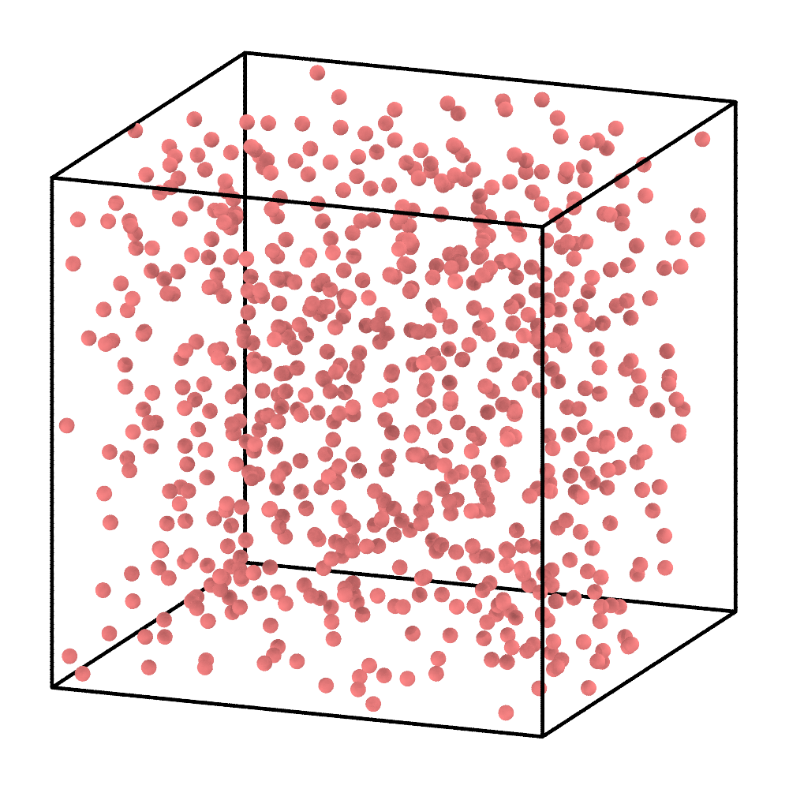
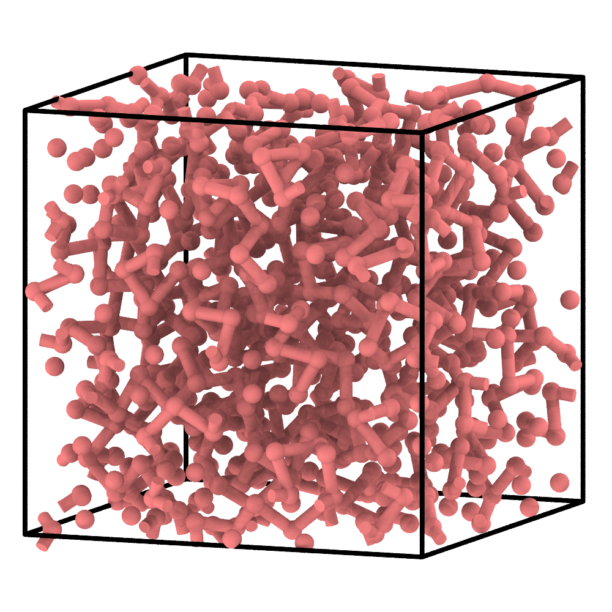
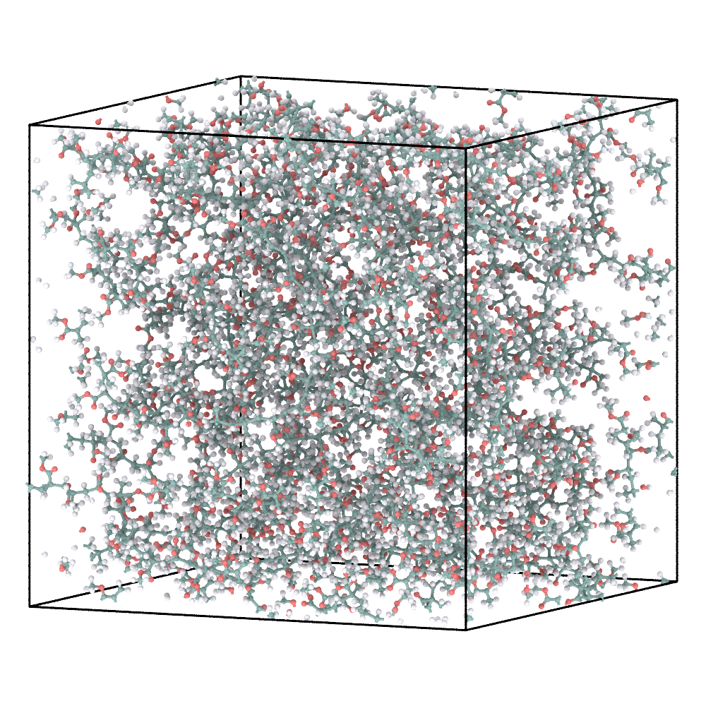
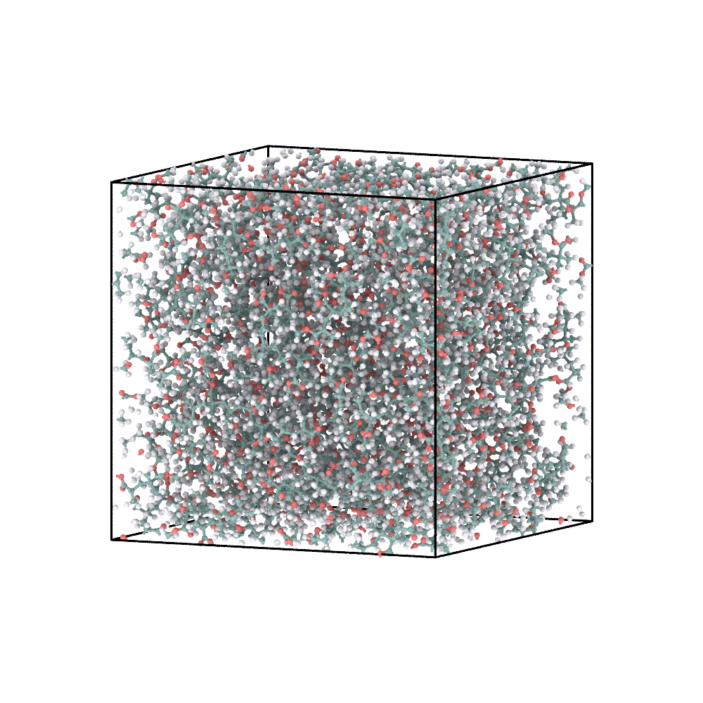

# 2. Radical PMMA: move an active state during chain growth

This example keeps the same four-stage workflow but changes the reaction
mechanism: chain growth proceeds from an active CG site.

## 1. Define the reactant

Methyl methacrylate `P` is the only molecular reactant. Each molecule is
represented by one coral CG bead.

```{figure} ../_static/tutorials/02_radical_pmma/reactants.svg
:alt: Molecular structure of methyl methacrylate P mapped to a coral CG bead.
:width: 58%

Methyl methacrylate and its one-bead CG representation.
```

```{literalinclude} example-files/02_radical_pmma/config.json
:language: json
```

`N: 600` creates the starting population, `activate: 1` selects one initial
active site, and `max_valence: 2` permits an incorporated bead to connect to
two neighbours. The radical rule represents:

```text
P* + P  →  P—P*
```

`activation: {"from": 0, "to": 1}` transfers activity from the growing end to
the newly incorporated monomer. The mapped SMARTS separately defines the
atomistic bond change.

## 2. Run radical CG polymerization

Run this command from the extracted tutorial directory (or replace the paths
with absolute paths). `--name` identifies the workspace for this example;
`02_radical_pmma/cg/` receives the generated `initial.xml`,
`cg_parameters.json`, and `run_pygamd_polymerization.py`.

```bash
chemfast prepare_cg --json 02_radical_pmma/config.json --name 02_radical_pmma
```

Next, switch to `02_radical_pmma/cg/` and run the **generated** PyGAMD script
with an interpreter that supports PyGAMD:

```bash
python run_pygamd_polymerization.py initial.xml cg_parameters.json --gpu=0
```

Once PyGAMD finishes, `02_radical_pmma/cg/` should contain the matching
`reaction_final.xml` and `reaction_path.txt`. Return to the extracted tutorial
directory before using the relative `--name` in the following command; alternatively,
provide the absolute workspace path to run the CLI from anywhere.

| Initial CG monomers | Polymerized and pre-equilibrated CG configuration |
|---|---|
|  |  |

The active state propagates along an accepted sequence of `P-P` events.
`activate` sets the number of initial growth fronts; it does not prescribe a
final chain length.

## 3. Reconstruct the atomistic model

```bash
chemfast reconstruct_aa --name 02_radical_pmma
```

The CLI reads `02_radical_pmma/config.json` and the two fixed CG outputs from
`02_radical_pmma/cg/`, then writes the reconstructed SDF and GROMACS files to
`02_radical_pmma/aa/`. No CG result filenames need to be passed again.

| Final CG configuration | Energy-minimized AA reconstruction |
|---|---|
|  |  |

ReactionPath replay converts each accepted `P-P` event into its mapped
atomistic transformation. The final CG configuration supplies the spatial
reference for placing the reconstructed chains.

## 4. Briefly equilibrate the AA model

See [AA relaxation](aa-relaxation.md) for the external GROMACS steps used to
produce EM/EQ coordinates from the reconstructed `system.gro`.

| Energy-minimized AA model | AA model after the supplied short equilibration |
|---|---|
|  |  |

This short continuation checks the reconstructed coordinates and exported force
field. A scientific production run requires a system-specific equilibration
protocol.

## What to inspect

- the ReactionPath contains only `P-P` events;
- activity moves between participants rather than multiplying;
- no CG node exceeds degree two;
- atom counts, topology, coordinates, and force-field exports remain
  consistent.

Next: [Cross-linked polyimide](network.md).
