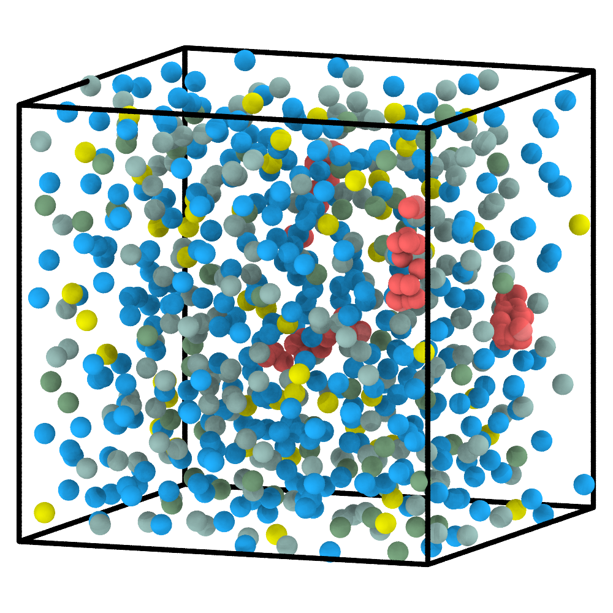
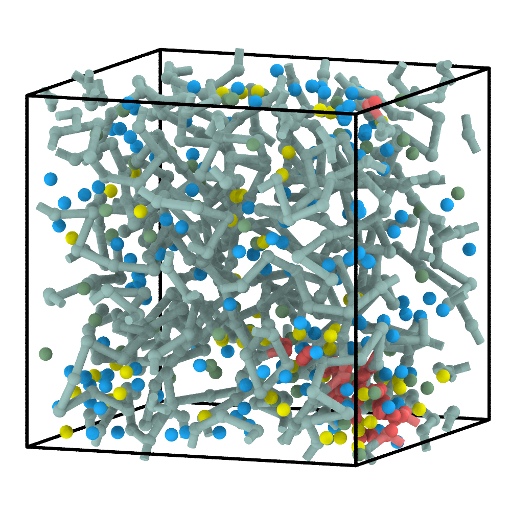
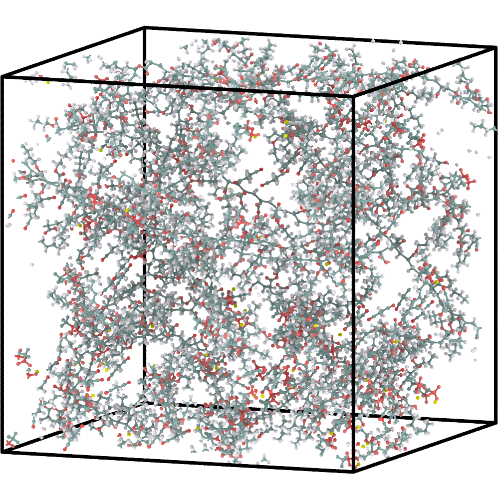
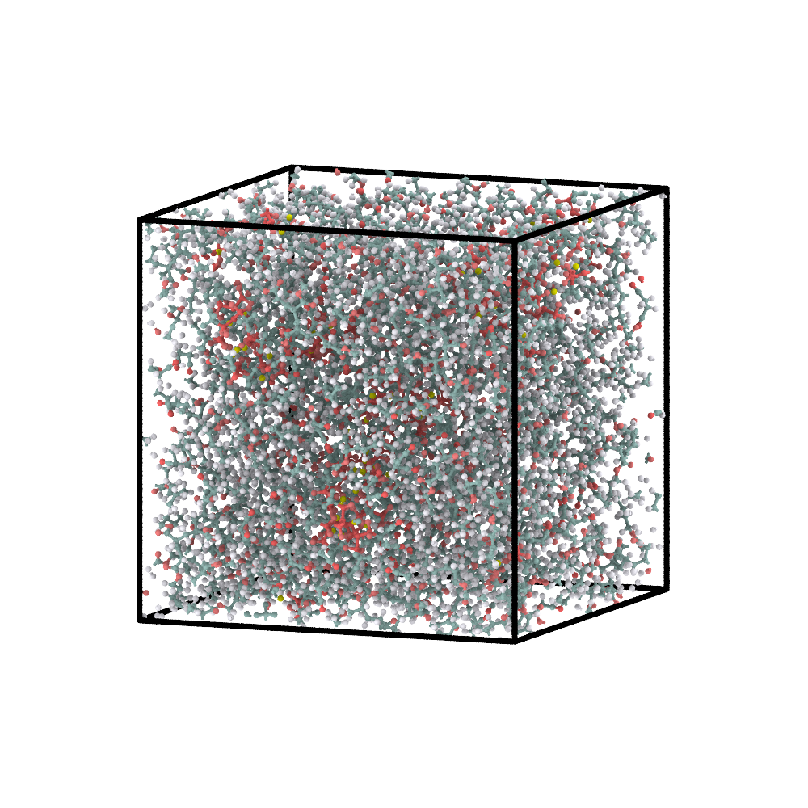

# 5. Multicomponent SPE: combine a reactive network and spectators

This reactive example combines a free reactive monomer, a PDB crosslinker, ions,
and a molecular plasticizer in one construction workflow.

## 1. Define all components

The figure shows every complete molecular or structured component. The local
`C` SMARTS is not a separate molecule; it identifies reactive groups inside
the complete `CL` crosslinker.

```{figure} ../_static/tutorials/06_spe/reactants.svg
:alt: Complete molecular components A, lithium, TFSI, succinonitrile, and the structured crosslinker with their CG representations.
:width: 100%

Reactive and non-reactive components in the SPE formulation.
```

```{literalinclude} example-files/06_spe/config.json
:language: json
```

| Component | Source | Role |
|---|---|---|
| `A` | 200 free molecules | reactive acrylate; four sites initially active |
| `CL` | four PDB copies | rigid crosslinker with two mapped `C` arms per copy |
| `L` | 57 free ions | Li spectator |
| `T` | 57 free ions | TFSI spectator |
| `S` | 342 free molecules | succinonitrile spectator |

`A-A` propagates between acrylates, while `C-A` and `A-C` connect the
mapped crosslinker sites in either participant order. L, T, and S never appear
in a reaction rule and remain non-reactive during construction.

**CG non-bonded parameters:** L (`[Li+]`) is monatomic: the updated generator
uses twice the elemental vdW radius for its default sigma, skips HSP prediction,
and assigns the median normalized epsilon of the multi-atom reactants.

## 2. Construct and relax the CG system

```bash
python prepare_cg.py 06_spe
cd 06_spe/cg
python run_pygamd_polymerization.py initial.xml cg_parameters.json --gpu=0
cd ../..
```

| Initial multicomponent CG mixture | Polymerized and pre-equilibrated CG system |
|---|---|
|  |  |

The reactive species form the network while the ions and succinonitrile remain
present in the same box. Composition and reaction history should therefore be
checked separately.

## 3. Reconstruct the atomistic system

```bash
python reconstruct_aa.py 06_spe
```

| Final CG configuration | Energy-minimized AA reconstruction |
|---|---|
|  |  |

ChemFAST restores the full crosslinker geometries, replays the recorded network
reactions at their mapped atoms, and retains all spectator components in the AA
system.

## 4. Briefly equilibrate the AA model

See [AA relaxation](aa-relaxation.md) for the external GROMACS steps used to
produce EM/EQ coordinates from the reconstructed `system.gro`.

| Energy-minimized AA model | AA model after the supplied short equilibration |
|---|---|
|  |  |

The short continuation provides an initial relaxation of the reconstructed
multicomponent box. Transport or thermodynamic calculations require a separate,
validated equilibration and production protocol.

## What to inspect

- L and T counts remain equal and neither type enters the ReactionPath;
- S remains non-reactive;
- every mapped C arm refers to the intended atoms of the crosslinker PDB;
- ReactionPath events are limited to `A-A`, `C-A`, and `A-C`;
- the AA export includes every component and all files referenced by
  `system.top`.

Next: [PS-b-PEO: a separate predefined-topology workflow](block-ps-peo.md).
