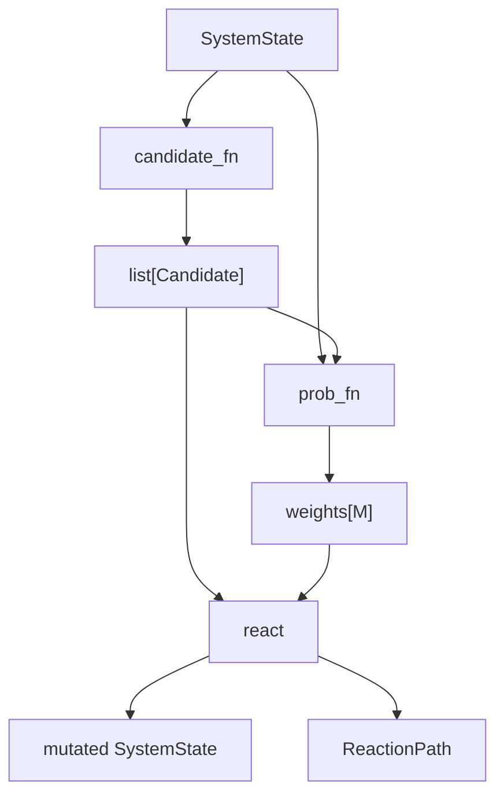
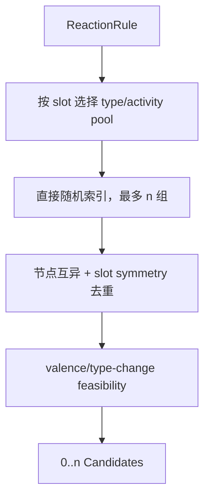
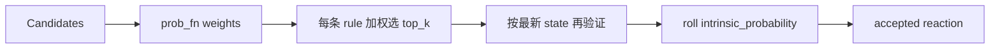
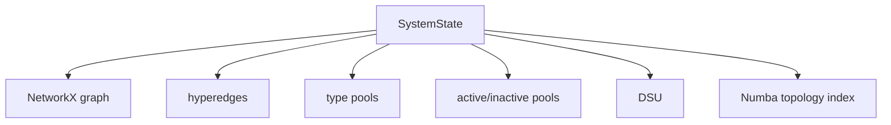
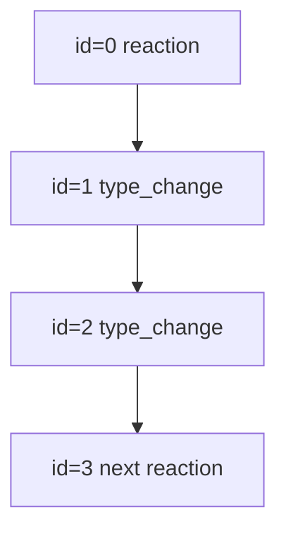

# Reaction DSL API

本文描述用户可直接接入的 candidate、probability、simulator 和 state API。

## 1. 主循环与数据流

```python
import numpy as np

rng = np.random.default_rng(seed)
state = model.initial_state(rng)
reaction_path = empty_path()

for step in range(total_steps):
    candidates = candidate_fn(state, candidate_n, rng)
    weights = prob_fn(state, candidates)
    accepted = react(
        candidates,
        weights,
        state,
        reaction_path,
        top_k=top_k,
        rng=rng,
    )
```



## 2. 常用导入

```python
from chemfast.cg.reaction_dsl import (
    Candidate,
    FillerArm,
    FillerType,
    ReactionEvent,
    TypeChangeEvent,
    analyze_pair_topology,
    candidate_is_valid,
    choose_candidates,
    compile_dict,
    compile_file,
    empty_path,
    graph_distance,
    initialize_dict,
    initialize_file,
    react,
    same_molecule,
    simulate,
    state_to_incidence_nx,
    state_to_nx,
)
```

## 3. Compiler API

### 3.1 `compile_file`

```python
model = compile_file("config.json")
```

输入 JSON 文件路径，返回 `CompiledModel`。JSON 语法错误、缺少必需字段或
RDKit 检查失败时抛出 `DSLValidationError`。

### 3.2 `compile_dict`

```python
model = compile_dict(config)
```

输入已加载的 Python dictionary，适合程序动态构造或修改配置。

`reactants`、`fillers`、`reactions` 的输入形式都是 `list[dict]`，每个条目
必须含 `name`。Compiler 返回时再按名称编译为三个 mapping：

`CompiledModel` 的三组静态定义为：

```python
model.reactants
model.fillers
model.reactions
```

### 3.3 `initial_state`

```python
rng = np.random.default_rng(seed)
state = model.initial_state(rng)
```

一次性创建全部普通 reactants、filler 中心、arms、初始结构边和动态索引。
当前模型的节点数在反应过程中保持不变，增长的是 reaction edges、
hyperedges 和 connected components 的规模。

所有 reactive 节点先以 inactive 状态创建。随后对每个 type，从包含
standalone nodes 与 filler arms 的完整 type pool 中，无放回随机抽取
`reactant.activate` 个节点进入 active pool。显式传入 `Generator` 保证这一
阶段与后续 candidate/react 使用同一随机数流。

### 3.4 直接初始化 `state + reaction_path`

```python
rng = np.random.default_rng(seed)
state, reaction_path = initialize_file("config.json", rng)
```

`initialize_file()` 是粒子模拟使用的低层入口。它等价于：

```python
model = compile_file("config.json")
state = model.initial_state(rng)
reaction_path = ReactionPath()
```

`initialize_dict(config, rng)` 提供相同的 dictionary 入口。它们不执行循环，
也不接收 `candidate_fn` 或 `prob_fn`。原有 `compile_file()`、
`compile_dict()`、`simulate()` 全部保留。

## 4. Candidate 数据结构

```python
Candidate(
    reaction="A-B-to-C",
    nodes=(17, 42),
)
```

| 字段 | 类型 | 含义 |
| --- | --- | --- |
| `reaction` | `str` | `state.reactions` 中的规则名。 |
| `nodes` | `tuple[int, ...]` | 按规则 slot 顺序排列的全局 node ids。 |

必须满足：

```text
len(candidate.nodes) == len(rule.reactants)
state.graph.nodes[candidate.nodes[i]]["type"] == rule.reactants[i]
```

Candidate 只代表“这组节点按这条规则提出一次反应”。它不包含 weight、
空间距离或接受状态。

## 5. 内置 `choose_candidates`

签名：

```python
choose_candidates(
    state,
    n=300,
    rng=None,
) -> list[Candidate]
```

`n` 是每条 reaction rule 的 raw proposal budget，而不是所有 rules 共用的
总数。



### 5.1 Pool 选择

| Rule | Slot | Pool |
| --- | --- | --- |
| general | 所有 slots | `type_nodes[type]`，不筛 active |
| radical | `activation.from` 指定的每个 slot | `active_nodes[type]` |
| radical | 其他 slots | `inactive_nodes[type]` |
| radical 且 `from=null` | 所有 slots | `inactive_nodes[type]` |

### 5.2 Valence 行为

Pool 本身不按 valence 分桶。Raw tuple 产生后检查：

```text
valence[node] + degree_delta[slot] <= max_valence[node]
```

不满足的 tuple 不会出现在最终 Candidate list。由于 generator 固定只尝试
`n` 次，它不保证补齐 `n` 个合法 candidates。

### 5.3 复杂度

若共有 \(R\) 条规则、每条约 \(k\) 个 slots：

\[
T_{\mathrm{choose}}\approx O(Rnk)
\]

它通常不随总节点数增长，因为 `NodePool` 支持 \(O(1)\) 随机索引。反应后期
满价态比例很高时，运行时间仍近似固定，但返回的合法 candidates 会减少。

## 6. 自定义 `candidate_fn`

`simulate()` 需要的接口是：

```python
def candidate_fn(state, n, rng):
    return candidates
```

输入：

| 参数 | 含义 |
| --- | --- |
| `state` | 当前可变 `SystemState`。 |
| `n` | `simulate(candidate_n=...)` 传入的预算。 |
| `rng` | 模拟器统一持有的 `numpy.random.Generator`。 |

输出：

```text
Sequence[Candidate]
```

### 6.1 外部粒子模拟 pair

```python
from chemfast.cg.reaction_dsl import Candidate, candidate_is_valid


def particle_candidates(state, n, rng):
    neighbor_pairs = particle_engine_neighbor_pairs()
    candidates = [
        Candidate("A-B", (int(i), int(j)))
        for i, j in neighbor_pairs[:n]
    ]
    return [
        candidate
        for candidate in candidates
        if candidate_is_valid(state, candidate)
    ]
```

外部程序必须保证 tuple 顺序符合 rule slots。`candidate_is_valid()` 会检查：

- reaction 是否对应当前节点 type；
- radical active/inactive role；
- 节点是否 reactive；
- 节点是否重复；
- 当前与目标 type 的 max valence。

`react()` 在真正提交前仍会再验证一次，因为同一 outer step 内较早执行的
proposal 可能改变后续 proposal 的 type、active 或 valence。

## 7. Probability API

`simulate()` 需要：

```python
def prob_fn(state, candidates):
    return weights
```

输出必须是一维非负数列：

```text
len(weights) == len(candidates)
weights[i] 对应 candidates[i]
```

### 7.1 Weight 语义

- `weight > 0`：参与本 rule 内的相对加权抽样；
- `weight == 0`：硬拒绝；
- weight 不是最终反应概率；
- 负数、NaN 或 infinity 非法。

最终是否接受由 JSON 中的 `intrinsic_probability` 决定：

```text
random_draw < intrinsic_probability
```



### 7.2 最简单的等权模型

```python
import numpy as np


def uniform_prob(state, candidates):
    return np.ones(len(candidates), dtype=float)
```

### 7.3 使用外部空间距离

```python
import numpy as np


def distance_prob(state, candidates):
    weights = np.ones(len(candidates), dtype=float)
    for i, candidate in enumerate(candidates):
        if len(candidate.nodes) != 2:
            continue
        left, right = candidate.nodes
        distance = particle_distance(left, right)
        weights[i] = np.exp(-distance)
    return weights
```

### 7.4 使用当前拓扑距离

```python
import numpy as np

from chemfast.cg.reaction_dsl import analyze_pair_topology


def topology_prob(state, candidates):
    weights = np.ones(len(candidates), dtype=float)
    pair_indices = [
        i for i, candidate in enumerate(candidates)
        if len(candidate.nodes) == 2
    ]
    pairs = [candidates[i] for i in pair_indices]
    topology = analyze_pair_topology(state, pairs, cutoff=15)

    pair_indices = np.asarray(pair_indices, dtype=np.int64)
    reject = topology.same_molecule & (topology.distance < 5)
    weights[pair_indices[reject]] = 0.0
    return weights
```

`analyze_pair_topology()` 先使用 DSU 排除不同 molecule，再对同 molecule
candidates 按 source 分组，运行 Numba 多目标 cutoff BFS。

### 7.5 Filler 短环限制

若纯随机模拟要求涉及 filler arm 的闭环图距离必须至少为 50：

```python
import numpy as np

from chemfast.cg.reaction_dsl import analyze_pair_topology


def filler_loop_prob(state, candidates):
    weights = np.ones(len(candidates), dtype=float)
    indices = np.asarray([
        i
        for i, candidate in enumerate(candidates)
        if len(candidate.nodes) == 2
        and any(
            state.graph.nodes[node]["kind"] == "filler_arm"
            for node in candidate.nodes
        )
    ], dtype=np.int64)
    pairs = [candidates[i] for i in indices]
    topology = analyze_pair_topology(state, pairs, cutoff=49)
    reject = topology.same_molecule & (topology.distance < 50)
    weights[indices[reject]] = 0.0
    return weights
```

不同 molecule 的 pair 由 DSU 近似 \(O(1)\) 通过；同 molecule 才进入局部
BFS。严格动态 graph distance 不能仅由并查集得到。

## 8. `react`

签名：

```python
react(
    candidates,
    weights,
    state,
    reaction_path,
    top_k=30,
    rng=None,
) -> list[ReactionEvent]
```

`top_k` 是每条 rule 的 proposal 上限。返回值只包含成功接受的主
`ReactionEvent`；耦合的 `TypeChangeEvent` 直接追加到 `reaction_path`。

每个 outer step：

1. 按 `candidate.reaction` 分组；
2. 丢弃 weight 0 或当前非法的 candidates；
3. 每组按 weights 无放回选至多 `top_k` 个；
4. 混洗不同 rules 的 proposals；
5. 每次提交前按最新 state 再验证；
6. roll `intrinsic_probability`；
7. 接受时执行主 operator；
8. 追加主 reaction event；
9. radical rule 将所有 source slots 失活，再按需激活 target；
10. 顺序执行并追加 type-change events。

### 8.1 为什么提交前必须重新验证

假设同一批 proposals 包含：

```text
P-A
P-B
```

而 P 只剩一个 valence。两条 proposal 在 outer step 开始时分别合法，但
第一条成功后，第二条必须被最新 state 拒绝。

## 9. `simulate`

```python
state, reaction_path = simulate(
    model,
    total_steps=1000,
    candidate_fn=choose_candidates,
    prob_fn=uniform_prob,
    candidate_n=300,
    top_k=30,
    seed=42,
)
```

参数：

| 参数 | 含义 |
| --- | --- |
| `model` | `CompiledModel`。 |
| `total_steps` | 最大 outer steps。 |
| `candidate_fn` | Candidate provider。 |
| `prob_fn` | Proposal weight provider。 |
| `candidate_n` | 传给 candidate provider 的预算。 |
| `top_k` | 每条 rule 每 step 的最大 proposal 数。 |
| `seed` | 统一随机种子。 |

如果某一步 `candidate_fn` 返回空序列，`simulate()` 提前结束。

### 9.1 粒子模拟显式循环

`run_particle_simulation.py` 展示另一条并列路径：

```python
rng = np.random.default_rng(seed)
state, reaction_path = initialize_file(json_path, rng)

for _ in range(total_reaction_steps):
    positions = run_md(simulation, md_loops)
    candidates = particle_candidates(state, positions, cutoffs, box_size)
    weights = particle_prob(state, candidates, positions, box_size)

    event_start = len(reaction_path.events)
    react(candidates, weights, state, reaction_path, rng=rng)
    step_events = reaction_path.events[event_start:]
    update_simulation_context(simulation, state, step_events)
```

示例 `particle_candidates()` 直接枚举一元 rule 的合法 pool；对每条二体
rule：

1. 按 slot type 和 radical/general 状态读取对应 NodePool；
2. 通过 `state.zone()` 排除价态不足节点；
3. 用全局 node id 索引 `positions`；
4. 对两个 slot pools 构造周期性 `cKDTree`；
5. 用 rule-specific cutoff 生成邻居 pairs；
6. 保持 reaction slot 顺序构造 `Candidate`；
7. 用 `candidate_is_valid()` 完成外部 candidate 的最终状态检查。

三体及以上粒子邻居组合与具体引擎的数据结构有关，示例在对应分支明确留出
triplet/tuple neighbor builder，不静默忽略规则。

该文件假设 simulation context 提供：

```text
simulation.run(md_loops)
simulation.positions
simulation.update_from_reaction_events(state, step_events)
```

`step_events` 是本反应步新增的 `ReactionEvent` 和 `TypeChangeEvent`，因此 context
可以同时更新成键、粒子 type 及相关参数。

## 10. SystemState

主要字段：

| 字段 | 含义 |
| --- | --- |
| `graph` | NetworkX `MultiGraph` pairwise projection。 |
| `hyperedges` | 成功主反应的显式 n-body records。 |
| `reactions` | 编译后的 reaction rules。 |
| `type_nodes` | 按当前 type 索引的 NodePools。 |
| `active_nodes` | 按当前 type 索引的 active NodePools。 |
| `inactive_nodes` | 按当前 type 索引的 inactive NodePools。 |
| `connectivity` | DSU connected-component index。 |
| `topology_index` | Numba BFS 使用的增量紧凑邻接结构。 |
| `step` | 当前 outer step。 |



### 10.1 Node attributes

```python
data = state.graph.nodes[global_node_id]
```

普通 reactive node：

```text
kind
type
instance
reactive
max_valence
valence
active
```

Filler arm 额外包含：

```text
filler_type
filler_instance
cg_id
atom_idx
```

### 10.2 Pool 更新

- `state.set_active()`：active/inactive pools 之间 swap-delete；
- `state.change_type()`：type pool 和当前 activity pool 同步移动；
- `B -> B`：不移动 pool，只记录 path event；
- valence：直接更新 node attribute，不进入单独 pool。

Pool 顺序无语义，因此 swap-delete 不影响模拟正确性。

## 11. Topology API

### 11.1 `same_molecule`

```python
connected = same_molecule(state, (i, j))
```

使用 DSU，复杂度近似 \(O(1)\)。

### 11.2 `graph_distance`

```python
distance = graph_distance(state, i, j, cutoff=15)
```

返回：

| 情况 | 值 |
| --- | --- |
| 不同 molecule | `None` |
| 同 molecule 且距离 `<= cutoff` | 精确距离 |
| 同 molecule 且距离 `> cutoff` | `cutoff + 1` |
| `cutoff=None` | 完整最短距离 |

### 11.3 `analyze_pair_topology`

```python
topology = analyze_pair_topology(state, binary_candidates, cutoff=15)
```

返回两个与 candidates 对齐的 NumPy arrays：

```text
topology.same_molecule
topology.distance
```

同一个 source 的多个 targets 只运行一次 Numba BFS。

## 12. Graph 输出

### 12.1 `state_to_nx`

```python
graph = state_to_nx(state)
```

返回 pairwise `MultiGraph` 副本。Node key 本身就是全局 index：

```python
for global_index, data in graph.nodes(data=True):
    print(global_index, data["type"])
```

### 12.2 `state_to_incidence_nx`

```python
incidence = state_to_incidence_nx(state)
```

将每个 reaction hyperedge 变为 relation node，适合保留真正的多体关系。

## 13. ReactionPath API

```python
events = reaction_path.events
serializable = reaction_path.to_dict()
```



### 13.1 `ReactionEvent`

保存：

```text
id, step, kind="reaction", reaction, nodes, pair_edges,
hyperedge_id, weight, intrinsic_probability, random_draw
```

### 13.2 `TypeChangeEvent`

保存：

```text
id, step, kind="type_change", reaction, parent_event_id,
slot, node, from_type, to_type
```

一个 accepted reaction 的所有 type-change events：

- 与主事件具有相同 `step`；
- 紧跟主事件；
- `parent_event_id` 指向主事件；
- 顺序与 JSON `type_changes` 数组一致。

## 14. 复杂度摘要

设：

- \(V\)：总节点数；
- \(R\)：reaction rules 数；
- \(n\)：每 rule candidate budget；
- \(k\)：平均反应元数；
- \(M\le Rn\)：本 step 实际 candidates；
- \(B_c\)：cutoff 邻域大小。

| 操作 | 复杂度 |
| --- | --- |
| 初始 state | \(O(V+E_{\text{filler}})\) |
| 默认 candidate 抽样 | 约 \(O(Rnk)\) |
| type/active pool 移动 | 摊销 \(O(1)\) |
| valence 更新 | \(O(1)\) / node |
| DSU same-molecule | \(O(\alpha(V))\) |
| cutoff topology | \(O(M+\sum B_c)\) |
| append path event | 摊销 \(O(1)\) |

固定 `candidate_n`、低反应元数和有界 cutoff 下，单个 outer step 的主要成本
不随整个 \(V\) 做全组合增长。
