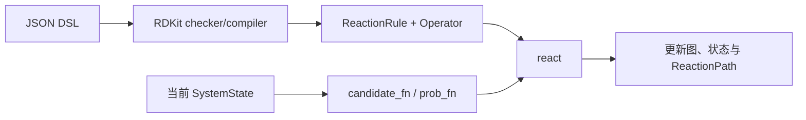
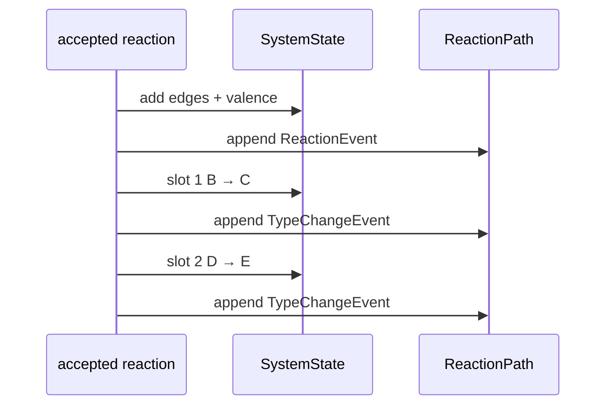
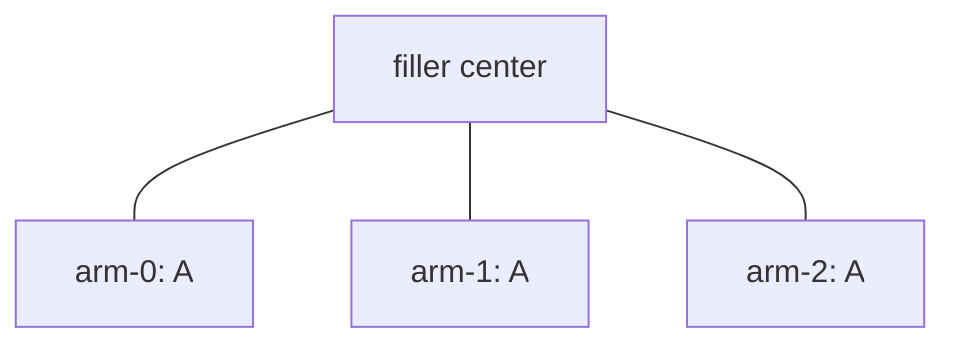

# Reaction DSL v1：设计哲学与反应语义

## 1. 这门 DSL 描述什么

Reaction DSL 是一门极简的粗粒化图反应语言。它只回答四个问题：

1. 初始体系中有哪些粗粒化节点和 filler arms；
2. 哪些节点类型可以共同参与一条反应规则；
3. 反应接受后，粗粒化图如何增加边或超边；
4. 反应是否还耦合 active 转移或 type change。

坐标邻近、场论、势能、扩散和动力学模型都不属于 DSL。它们通过
`candidate_fn` 和 `prob_fn` 接口进入模拟器。



## 2. 五条核心设计原则

### 2.1 Slot 是所有数据之间的唯一坐标

一条规则中的以下位置必须严格对齐：

```text
reactants[i]
SMARTS 左侧第 i 个模板
Candidate.nodes[i]
operator.degree_delta[i]
type_changes[*].node
activation.from / activation.to
```

例如：

```json
"reactants": ["A", "B"]
```

意味着 candidate `(17, 42)` 中：

- slot 0 是节点 17，必须是 `A`；
- slot 1 是节点 42，必须是 `B`。

### 2.2 SMARTS 只决定粗粒化连边

二元及以上反应由 RDKit 解析 reaction SMARTS。Compiler 只查看第一产物，
根据 atom map 判断产物中的跨 slot 键，从而生成粗粒化
`ReactionOperator.edges`。

SMARTS 不负责推断：

- active 如何转移；
- 粗粒化 type 如何变化；
- candidate 的空间概率；
- 反应速率。

### 2.3 `max_valence` 是统一的反应边容量

节点的 `valence` 只统计 reaction operator 新增的粗粒化边。Filler 中心到 arm
的结构边不计入 reaction valence。

某个 slot 可用的必要条件是：

```text
current_valence + operator.degree_delta[slot] <= current_max_valence
```

### 2.4 General 与 radical 只由规则决定

- `kind` 省略或写为 `"general"`：所有 slots 按 type 抽取，不筛 active。
- `kind: "radical"`：`activation.from` 指定的 slots 从 active pool 抽取，其余 slots
  从 inactive pool 抽取。

Reactant 中的 `activate` 只定义从该 type 完整节点池中随机选择的初始 active
数量，不决定某条规则属于 general 还是 radical。同一种 type 可以同时参加
两类规则。

### 2.5 Type change 是主反应的确定性耦合事件

`type_changes` 不产生新的 candidate，不重新计算 weight，也不进行第二次
固有概率判定。一次主反应被接受后：

1. 执行主 reaction operator；
2. 在 `ReactionPath` 中记录主 `ReactionEvent`；
3. 按 JSON 顺序执行并记录一个或多个 `TypeChangeEvent`。

它在状态机中是一次原子提交，在 reaction path 中则展开为连续的伪时序事件。



## 3. 顶层结构

```json
{
  "domd_react_dsl": "v1",
  "cg_topology_file": "final_cg.xml",
  "reactants": [],
  "fillers": [],
  "reactions": []
}
```

只有 DSL 版本、`reactants` 和 `reactions` 必需。三个实体 section 均为
`list[dict]`，条目通过 `name` 标识。Checker 只检查 DSL 实际消费的
字段；用于其他工作流的额外 JSON 字段会被忽略。

这些 JSON 关键字全部由 `chemfast.settings` 定义，包括新版所需的
`NAME_CONF = "name"`。修改常量和输入 JSON 即可统一换名；compiler 不提供
旧 object schema 或旧字段名兼容分支。

## 4. Reactant type

完整分子 type：

```json
{
  "name": "A",
  "smiles": "CC",
  "N": 1000,
  "max_valence": 2,
  "activate": 0
}
```

分子片段 type：

```json
{
  "name": "ARM",
  "smarts": "[NH3]",
  "max_valence": 1
}
```

- `name`：条目唯一标识；
- `smiles` 与 `smarts`：必须且只能写一个，并能被 RDKit 解析；
- `N`：可选，默认 0，只允许与 `smiles` 共存，表示独立生成数；
- `max_valence`：该 type 的 reaction edge 上限；
- `activate`：可选，默认 0，表示从该 type 的完整节点池中随机抽取多少个
  初始 active 节点。

`smarts` type 不允许 `N`，不会独立生成，但可以随 filler arm 生成。若一个
`smiles` type 同时具有 `N` 且被 filler 引用，则两类节点相加，`N` 不是 type
总数上限。`activate` 与节点来源无关，它作用于：

```text
standalone nodes ∪ all filler arms of this type
```

因此 SMARTS type 也可以设置 `activate`，并把 filler arms 作为初始 radical
source。编译时只要求 `activate` 不超过该 type 最终生成的节点总数。

节点的动态反应状态是：

```text
type, active, valence, max_valence
```

## 5. Filler 与反应 arms

```json
{
  "name": "Core",
  "N": 10,
  "file": "core.pdb",
  "mappings": [
    {
      "cg_id": 0,
      "type": "A",
      "atom_idx": [0, 1, 2]
    },
    {
      "cg_id": 1,
      "type": "A",
      "atom_idx": [3, 4, 5]
    }
  ]
}
```

`mapping` 固定为 `list[dict]`，每个条目显式提供 `cg_id`、`type` 和
`atom_idx`。旧的 `{"cg_id": {arm...}}` object 结构不再接受。

每个 filler 实例被展开为一个不可反应的中心和若干 reactive arms：



Arm 只引用 `type`；结构模式、`max_valence` 等全部来自对应 reactant。
Arm 进入该 type 的动态 pools。

## 6. General reaction

### 6.1 只成键

```json
{
  "name": "A-B",
  "reactants": ["A", "B"],
  "smarts": "[C:1].[N:2]>>[C:1][N:2]",
  "intrinsic_probability": 0.5
}
```

省略 `kind` 即为 general。Candidate 两个 slots 均从对应 type pool 抽取，
active 状态不参与筛选，也不会被改变。

### 6.2 成键并耦合一个 type change

```json
{
  "name": "A-B-to-C",
  "reactants": ["A", "B"],
  "smarts": "[C:1].[N:2]>>[C:1][N:2]",
  "intrinsic_probability": 0.5,
  "type_changes": [
    {"node": 1, "to": "C"}
  ]
}
```

语义是：

```text
主反应：A(node i) + B(node j) → 建立 i-j reaction edge
耦合事件：candidate slot 1，即 node j，B → C
```

ReactionPath：

```text
event 0: ReactionEvent(A-B-to-C, nodes=(i,j))
event 1: TypeChangeEvent(slot=1, node=j, from=B, to=C, parent=0)
```

### 6.3 耦合多个 type changes

```json
{
  "name": "A-B-D",
  "reactants": ["A", "B", "D"],
  "smarts": "[C:1].[N:2].[O:3]>>[C:1][N:2][O:3]",
  "intrinsic_probability": 0.4,
  "type_changes": [
    {"node": 0, "to": "A1"},
    {"node": 2, "to": "D1"}
  ]
}
```

两个转换共享同一个主 reaction，按数组顺序紧接着写入 path。每个 slot
最多出现一次。

### 6.4 `B → B` 也是合法事件

```json
{
  "name": "A-B-tag",
  "reactants": ["A", "B"],
  "smarts": "[C:1].[N:2]>>[C:1][N:2]",
  "intrinsic_probability": 1.0,
  "type_changes": [
    {"node": 1, "to": "B"}
  ]
}
```

该事件不改变最终 type，也不移动 type pool，但仍生成：

```text
TypeChangeEvent(from=B, to=B)
```

这允许 reaction path 显式保存一个粗粒化耦合步骤，而不需要制造新的 type。

## 7. Radical reaction

```json
{
  "name": "P-P",
  "kind": "radical",
  "reactants": ["P", "P"],
  "smarts": "[C:1].[C:2]>>[C:1][C:2]",
  "intrinsic_probability": 0.35,
  "activation": {
    "from": 0,
    "to": 1
  }
}
```

`activation` 的语义：

| `from` | `to` | 状态变化 |
| --- | --- | --- |
| `null` | slot | 从 inactive 节点创建 active |
| slot A | slot B | active 从 A 转移到 B |
| slot A | slot A | active 保持在原节点 |
| slot | `null` | active 终止 |
| `[slot A, slot B]` | `null` | 两个 active 成键并同时终止 |

双自由基终止写为：

```json
{
  "name": "P-P-termination",
  "kind": "radical",
  "reactants": ["P", "P"],
  "smarts": "[C:1].[C:2]>>[C:1][C:2]",
  "intrinsic_probability": 0.1,
  "activation": {"from": [0, 1], "to": null}
}
```

该形式固定为二元规则：两个 slots 都必须来自 active pool，反应接受后执行
operator 并将两者同时移入 inactive pool。`max_valence` 约束与其他成键规则
完全相同。

Radical rule 不支持 `type_changes`。自由基状态只由 `activation` 表达，避免把
active transfer 与粗粒化 type 转换混成两套状态操作。

## 8. 一元反应

一元规则不写 `smarts`，operator 固定为：

```text
edges = ()
degree_delta = (0,)
```

一元 general 可用于纯 type coupling：

```json
{
  "name": "A-to-C",
  "reactants": ["A"],
  "intrinsic_probability": 0.2,
  "type_changes": [
    {"node": 0, "to": "C"}
  ]
}
```

成功后 path 仍是：

```text
ReactionEvent(A-to-C)
TypeChangeEvent(A → C)
```

一元 radical 用于引发、保持或淬灭：

```json
{
  "name": "P-quench",
  "kind": "radical",
  "reactants": ["P"],
  "intrinsic_probability": 0.1,
  "activation": {"from": 0, "to": null}
}
```

## 9. 多体 SMARTS 如何生成 Operator

Compiler 对第一产物执行以下步骤：

1. 将每个 atom-map 归属到一个 reactant slot；
2. 遍历第一产物的 bonds；
3. 跨 slot bond 转换为粗粒化 pair edge；
4. 相同 slot pair 去重；
5. slot graph 的度数成为 `degree_delta`。

对于 `reactants: ["A", "A", "A"]`：

| 产物 slot 拓扑 | `operator.edges` | `degree_delta` |
| --- | --- | --- |
| `A₀-A₁-A₂` | `((0,1),(1,2))` | `(1,2,1)` |
| 三角环 | `((0,1),(0,2),(1,2))` | `(2,2,2)` |

主反应会同时保存：

- NetworkX `MultiGraph` 中的 pairwise projection；
- `state.hyperedges` 中完整的 n-body tuple。

## 10. ReactionPath 的伪时序

主反应事件：

```json
{
  "id": 0,
  "step": 12,
  "kind": "reaction",
  "reaction": "A-B-to-C",
  "nodes": [17, 42],
  "pair_edges": [[17, 42]],
  "hyperedge_id": 9,
  "weight": 0.73,
  "intrinsic_probability": 0.5,
  "random_draw": 0.21
}
```

紧随其后的 type-change 事件：

```json
{
  "id": 1,
  "step": 12,
  "kind": "type_change",
  "reaction": "A-B-to-C",
  "parent_event_id": 0,
  "slot": 1,
  "node": 42,
  "from": "B",
  "to": "C"
}
```

二者具有相同的 outer `step`，通过连续 `id` 和 `parent_event_id` 表示耦合
关系。Type change 没有自己的 weight、固有概率或随机数。

## 11. Pool 与实时状态

State 维护三个索引：

```text
type_nodes[type]
active_nodes[type]
inactive_nodes[type]
```

它们都是 dense list + node-position map：

- 随机索引：\(O(1)\)；
- add：摊销 \(O(1)\)；
- remove：swap-delete，摊销 \(O(1)\)；
- pool 内顺序没有任何语义。

状态提交时：

| 状态变化 | 同步方式 |
| --- | --- |
| type change | 在 type pool 和对应 active/inactive pool 间移动 |
| active transfer | 在 active/inactive pools 间移动 |
| valence change | 直接更新节点属性 |
| reaction edge | 同步 NetworkX、DSU 和紧凑拓扑索引 |

Valence 不单独建立 pool。内置生成器从 type/activity pool 做固定预算 raw
抽样，再用最新 `valence + degree_delta` 过滤；`react()` 提交前还会按最新
state 再检查一次。因此满价态节点可能被 raw 抽中，但不会出现在合法提交中。

## 12. DSL 明确不做的事情

- 不定义空间邻居搜索；
- 不把 proposal weight 当作固有反应概率；
- 不从 SMARTS 推断 active 或 type change；
- 不为 type change 再生成 candidate；
- 不读取 filler 结构文件；
- 不实现逆反应或连续时间动力学；
- 不维护动态全源最短路；
- 不解释额外 JSON 元数据。

这些边界让 DSL 保持为一个小型、可检查、可编译的图状态机语言。
