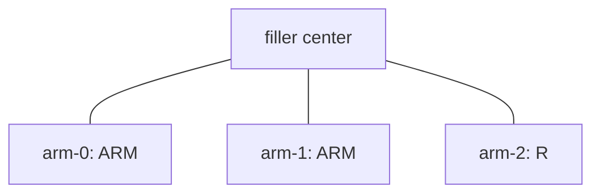

# Reaction DSL

Reaction DSL 将 JSON 反应规则编译为粗粒化图状态机，并提供可替换的
candidate 与 probability 接口。当前版本只保留两类反应：

- general：由 `max_valence` 控制的一元或任意多元反应；
- radical：显式描述 active source/target 的自由基反应。

状态由 NetworkX 图、显式反应超边、动态节点池和 `ReactionPath` 组成。
设计语义见 [DSL.md](DSL.md)，接入接口见 [API.md](API.md)。

## 1. 字段名设置

Compiler 只通过 `chemfast.settings` 读取 JSON 字段名。新版 list schema 需要新增
`NAME_CONF`：

```python
DSL_VERSION = "v1"
DSL_CONF = "domd_react_dsl"
REACTANT_CONF = "reactants"
FILLER_CONF = "fillers"
REACTION_CONF = "reactions"
CG_TOPOLOGY_FILE_CONF = "cg_topology_file"

NAME_CONF = "name"
COUNT_CONF = "N"
SMILES_CONF = "smiles"
SMARTS_CONF = "smarts"
MAX_VALENCE_CONF = "max_valence"
ACTIVATE_CONF = "activate"

FILE_CONF = "file"
MAPPING_CONF = "mappings"
CG_ID_CONF = "cg_id"
TYPE_CONF = "type"
ATOM_IDX_CONF = "atom_idx"

KIND_CONF = "kind"
GENERAL_KIND = "general"
RADICAL_KIND = "radical"
INTRINSIC_PROBABILITY_CONF = "intrinsic_probability"
ACTIVATION_CONF = "activation"
FROM_CONF = "from"
TO_CONF = "to"
TYPE_CHANGES_CONF = "type_changes"
NODE_CONF = "node"
```

例如要把顶层 `"reactions"` 改成 `"reaction"`，只修改
`REACTION_CONF` 和输入 JSON。代码没有旧字段别名或兼容分支。

## 2. 完整 JSON 结构

顶层 `reactants`、`fillers`、`reactions` 都是 `list[dict]`。每个条目用
`name` 标识：

```json
{
  "domd_react_dsl": "v1",
  "cg_topology_file": "network.xml",
  "reactants": [
    {
      "name": "A",
      "smiles": "C",
      "N": 1000,
      "max_valence": 2
    },
    {
      "name": "P",
      "smiles": "C",
      "N": 500,
      "max_valence": 2,
      "activate": 1
    },
    {
      "name": "ARM",
      "smarts": "[NH3]",
      "max_valence": 1,
      "activate": 4
    },
    {
      "name": "C",
      "smarts": "[NH3]",
      "max_valence": 3
    }
  ],
  "fillers": [
    {
      "name": "Core",
      "N": 20,
      "file": "core.pdb",
      "mappings": [
        {
          "cg_id": 0,
          "type": "ARM",
          "atom_idx": [0]
        },
        {
          "cg_id": 1,
          "type": "ARM",
          "atom_idx": [1]
        }
      ]
    }
  ],
  "reactions": [
    {
      "name": "A-A-to-C",
      "reactants": ["A", "A"],
      "smarts": "[CH4:1].[CH4:2]>>[C:1][C:2]",
      "intrinsic_probability": 0.5,
      "type_changes": [
        {"node": 1, "to": "C"}
      ]
    },
    {
      "name": "P-P",
      "kind": "radical",
      "reactants": ["P", "P"],
      "smarts": "[CH4:1].[CH4:2]>>[C:1][C:2]",
      "intrinsic_probability": 0.2,
      "activation": {
        "from": 0,
        "to": 1
      }
    },
    {
      "name": "ARM-A",
      "kind": "radical",
      "reactants": ["ARM", "A"],
      "smarts": "[NH3:1].[CH4:2]>>[N:1][C:2]",
      "intrinsic_probability": 0.8,
      "activation": {"from": 0, "to": 1}
    }
  ],
  "temperature": 450
}
```

`temperature` 等非 DSL 字段不会参与编译，会被直接忽略。旧的
`{"reactants": {"A": {...}}}` object schema 不再接受。

## 3. Reactant 定义

每个 reactant 条目必须包含：

| 字段 | 规则 |
| --- | --- |
| `name` | 非空、全局唯一的 type 名。 |
| `smiles` 或 `smarts` | 必须且只能出现一个，并通过 RDKit 解析。 |
| `max_valence` | 正整数，限制该 type 可增加的 reaction edges。 |

可选字段：

| 字段 | 默认值 | 规则 |
| --- | ---: | --- |
| `N` | `0` | 只允许用于 `smiles` type；仅表示独立生成数。 |
| `activate` | `0` | 从该 type 的全部生成节点中随机选择的初始 active 数量。 |

一个 type 的可激活总数为：

```text
type 总数 = standalone N + Σ(filler.N × 该 filler 中该 type 的 arm 数量)
```

`activate` 必须不超过这个最终总数。随机选择使用 `initial_state()` 接收的
NumPy `Generator`；`simulate(seed=...)` 会用同一个 generator 完成初始选择和
后续模拟，因此相同 seed 可复现。

### 3.1 `smiles`：完整分子 type

```json
{
  "name": "R",
  "smiles": "N",
  "N": 10,
  "max_valence": 3
}
```

这里会独立生成 10 个 `R`。如果 filler mapping 也引用 `R`，每条 filler arm
还会额外生成一个 `R` 节点。因此：

```text
R 总数 = R.N + Σ(filler.N × 该 filler 中 R arm 的数量)
```

`N` 不是该 type 的总数上限。

### 3.2 `smarts`：分子片段 type

```json
{
  "name": "ARM",
  "smarts": "[NH3]",
  "max_valence": 1,
  "activate": 4
}
```

`smarts` type 不允许写 `N`，因此不会独立生成。它可用于：

- filler arm 的 `type`；
- filler arm 上的初始 radical source；
- reaction 的某个 slot；
- `type_changes.to` 的目标 type。

这里的 4 个 active 节点从所有 `ARM` filler arms 中随机选择。SMARTS 禁止的
只有独立生成字段 `N`，不禁止 `activate`。

编译 reaction 时，`smiles` type 使用普通分子子结构匹配；`smarts` type 使用
RDKit query-query matching。

## 4. Filler 定义

```json
{
  "name": "Core",
  "N": 5,
  "file": "core.pdb",
  "mappings": [
    {
      "cg_id": 7,
      "type": "ARM",
      "atom_idx": [10, 11]
    }
  ]
}
```

| 字段 | 含义 |
| --- | --- |
| `name` | 唯一 filler 名。 |
| `N` | filler 实例数。 |
| `file` | 内坐标/结构文件元数据；本模块不读取其内容。 |
| `mapping` | `list[arm]`，至少一个 arm。 |
| `mapping[].cg_id` | 非负整数，且在该 filler 内唯一。 |
| `mapping[].type` | 已在 `reactants` 中声明的 type。 |
| `mapping[].atom_idx` | 非空且不重复的原子编号数组。 |

Filler arm 不再包含 `smarts`。所有化学 type 信息都来自
`reactants[type]`。

每个 filler 实例展开为一个不可反应中心和若干 reactive arms：



中心—arm 是结构边，不计入 arm 的 reaction valence。Arm 初始进入其 type 的
inactive pool。

## 5. Reaction 定义

每条 reaction 是数组中的一个具名条目：

| 字段 | 必需 | 含义 |
| --- | --- | --- |
| `name` | 是 | 唯一 rule 名。 |
| `reactants` | 是 | 有序 slot type 数组。 |
| `smarts` | 二元及以上 | RDKit reaction SMARTS。 |
| `intrinsic_probability` | 是 | `[0,1]` 的固有接受概率。 |
| `kind` | 否 | `"general"` 或 `"radical"`；省略为 general。 |
| `activation` | radical | active source slot、双终止 source slots 与 target slot。 |
| `type_changes` | general 可选 | 主反应后按顺序执行的 type coupling。 |

### General

```json
{
  "name": "A-B",
  "reactants": ["A", "B"],
  "smarts": "[C:1].[N:2]>>[C:1][N:2]",
  "intrinsic_probability": 0.5
}
```

General 从对应 type pool 抽取，不关心节点当前是否 active。

### Radical

```json
{
  "name": "P-P",
  "kind": "radical",
  "reactants": ["P", "P"],
  "smarts": "[C:1].[C:2]>>[C:1][C:2]",
  "intrinsic_probability": 0.2,
  "activation": {"from": 0, "to": 1}
}
```

- `from` 指定的 slot 从 active pool 抽取；
- 其他 slots 从 inactive pool 抽取；
- `from: 0, to: null` 表示淬灭；
- `from: null, to: 0` 表示一元激活；
- `from: 0, to: 0` 表示 active 留在原节点。

双自由基终止使用两个 active source，反应成功后两者同时失活：

```json
{
  "name": "P-P-termination",
  "kind": "radical",
  "reactants": ["P", "P"],
  "smarts": "[C:1].[C:2]>>[C:1][C:2]",
  "intrinsic_probability": 0.1,
  "activation": {"from": [0, 1], "to": null}
}
```

双终止固定为二元规则，`from` 必须包含两个不同的 slots，且 `to` 必须为
`null`。两个节点仍需满足 operator 的 `max_valence` 检查。

### General + type change

```json
{
  "name": "A-B-to-C",
  "reactants": ["A", "B"],
  "smarts": "[C:1].[N:2]>>[C:1][N:2]",
  "intrinsic_probability": 0.5,
  "type_changes": [
    {"node": 1, "to": "C"}
  ]
}
```

`node` 是 reaction slot index。主 `ReactionEvent` 记录后，每条
`type_changes` 会依次更新 type pool，并追加一个 `TypeChangeEvent`。

一元规则不需要 `smarts`：

```json
{
  "name": "P-quench",
  "kind": "radical",
  "reactants": ["P"],
  "intrinsic_probability": 0.1,
  "activation": {"from": 0, "to": null}
}
```

## 6. 最小运行

```python
from chemfast.cg.reaction_dsl import compile_file, simulate, state_to_nx


def run_reaction_dsl(json_path, total_steps, candidate_n=300, top_k=30, seed=None):
    model = compile_file(json_path)
    state, reaction_path = simulate(
        model,
        total_steps=total_steps,
        candidate_n=candidate_n,
        top_k=top_k,
        seed=seed,
    )
    return state_to_nx(state), reaction_path
```

```python
graph, reaction_path = run_reaction_dsl(
    "config.json",
    total_steps=1000,
    candidate_n=500,
    top_k=30,
    seed=42,
)
```

`graph` 是 `networkx.MultiGraph`，node key 就是全局 index：

```python
for global_index, data in graph.nodes(data=True):
    print(global_index, data["type"], data["valence"], data["active"])
```

Filler arm 节点额外包含：

```text
filler_type, filler_instance, cg_id, atom_idx
```

粒子模拟需要显式控制每个反应步时，使用低层初始化入口：

```python
rng = np.random.default_rng(seed)
state, reaction_path = initialize_file(json_path, rng)
```

随后由外层代码自行执行 MD、cKDTree 邻居搜索、probability、`react()` 和
simulation context 更新。完整示例见 `run_particle_simulation.py`。原有
`simulate(..., candidate_fn, prob_fn)` 接口保持不变。

## 7. Checker 边界

Checker 检查：

- 三个根 section 的数组结构以及条目 `name` 唯一性；
- reactant 的 `smiles/smarts` 二选一规则；
- `smarts` type 不含 `N`；
- RDKit 结构与 reaction SMARTS；
- filler arm 引用已声明 type；
- reaction slots、atom maps、operator 连通性；
- probability、activation、type changes 和 `max_valence`。

Checker 只要求并读取 DSL 使用的字段；条目或根对象中的其他字段直接跳过。
它不支持旧 object schema，也不猜测旧字段名。
